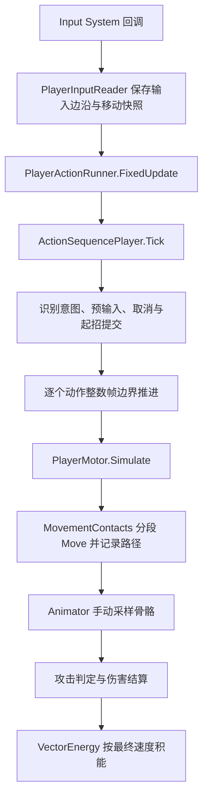
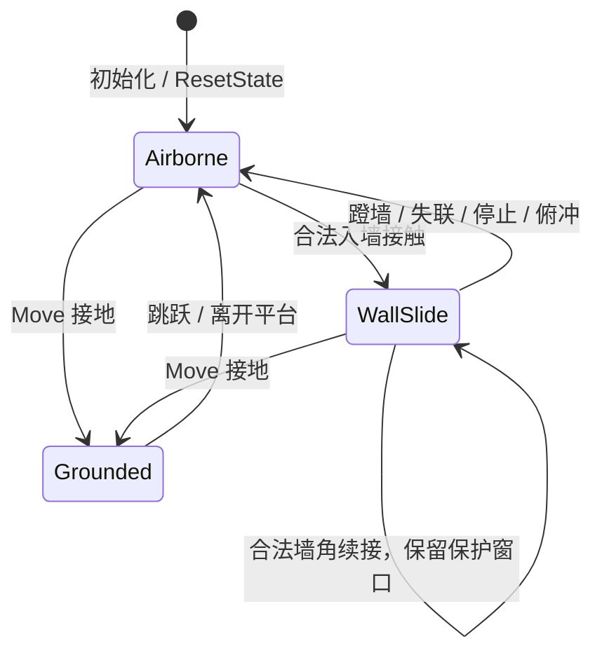

# PlayerMotor 与动作序列配表详解

本文面向接手移动代码的程序、调整动作手感的策划，以及接入动画和判定的开发者。内容依据 **2026-10-07 当前工作区** 的源码及已保存资产，包括工作区中尚未提交的改动；描述的是现有实现，不能直接当作策划案的全部功能验收结果。

数值有三种来源：`MovementParams.cs` 的字段初始化值、已保存的 `MovementParams.asset`、动作 `.asset` 的实际配置。本文分别列出，不把装配脚本的初始值当作当前调好的数值。场景实例还可能覆盖预制体字段，实际运行时应检查实例引用。

当前正式玩家预制体为 [Player.prefab](../Assets/Prefabs/Player.prefab)，正式动作集为 [PlayerActions.asset](../Assets/Settings/ActionSequences/Player/PlayerActions.asset)。旧说明中的 `character.prefab` 路径不适用于当前工作区。

## 阅读导航

1. [职责与运行链](#1-职责与运行链)
2. [三种时钟与帧的含义](#2-三种时钟与帧的含义)
3. [PlayerMotor 的状态与模拟顺序](#3-playermotor-的状态与模拟顺序)
4. [移动算法与边界行为](#4-移动算法与边界行为)
5. [MovementParams 完整参数表](#5-movementparams-完整参数表)
6. [Motor 对外接口与动作控制](#6-motor-对外接口与动作控制)
7. [动作配表的数据结构](#7-动作配表的数据结构)
8. [输入识别预输入取消与差分](#8-输入识别预输入取消与差分)
9. [动画位移伤害与命中判定](#9-动画位移伤害与命中判定)
10. [当前正式动作表逐项解读](#10-当前正式动作表逐项解读)
11. [编辑器操作与配表实例](#11-编辑器操作与配表实例)
12. [排错验证与扩展边界](#12-排错验证与扩展边界)

## 1. 职责与运行链

### 1.1 模块分工

| 模块 | 负责什么 | 关键实现 |
| --- | --- | --- |
| `PlayerInputReader` | Input System 回调、移动快照、带事件顺序的语义输入、输入所有权 | [源码](../Assets/Scripts/Movement/PlayerInputReader.cs) |
| `PlayerMotor` | 速度积分、地面/空中/划墙状态、滑铲姿态、胶囊变化、运动命令 | [源码](../Assets/Scripts/Movement/PlayerMotor.cs) |
| `MovementMath` | 加速、碰撞投影、入墙角、墙切线、蹬墙方向公式 | [源码](../Assets/Scripts/Movement/MovementMath.cs) |
| `MovementContacts` | 分段 `CharacterController.Move`、碰撞采集、墙探测、站起空间检查 | [源码](../Assets/Scripts/Movement/MovementContacts.cs) |
| `MovementParams` | 全局移动参数资产 | [定义](../Assets/Scripts/Movement/MovementParams.cs)、[当前资产](../Assets/Settings/MovementParams.asset) |
| `ActionSequencePlayer` | 输入请求仲裁、动作时间轴、取消权限、冷却；由调用方显式推进 | [源码](../Assets/Scripts/Actions/ActionSequencePlayer.cs) |
| `PlayerActionRunner` | 将执行器连接到玩家输入、Motor、动画、战斗和能量账户 | [源码](../Assets/Scripts/Actions/Player/PlayerActionRunner.cs) |
| `ActionAnimatorBridge` | 动作动画占用、手动求值、动作时间采样、收招返回基础动画 | [源码](../Assets/Scripts/Actions/Player/ActionAnimatorBridge.cs) |
| `PlayerCombat` / `CombatComponent` | 动作攻击上下文、分组伤害快照、统一受击结算和反馈 | [玩家适配](../Assets/Scripts/Player/PlayerCombat.cs)、[通用战斗](../Assets/Scripts/Components/CombatComponent.cs) |
| `ActionHitboxSampler` / `Hitbox` | 配表盒体、运动与旋转扫掠、目标查询及阻挡检查 | [采样器](../Assets/Scripts/Actions/Player/ActionHitboxSampler.cs)、[判定组件](../Assets/Scripts/Components/Hitbox.cs) |
| `VectorEnergy` | 唯一能量账户、按移动结果积能、起招扣费接口 | [源码](../Assets/Scripts/Player/VectorEnergy.cs) |
| `ActionSequenceWindow` | 编辑动作资产、取消图、独立预览、校验 | [源码](../Assets/Editor/Actions/ActionSequenceWindow.cs) |

`ActionSequencePlayer` 不自行读取设备、Unity 时间、Animator 或 Motor。它使用 Unity 数学/资产类型，但执行推进本身是显式输入的逻辑类。角色相关行为通过 Host、Sink 和可选的 SimulationSink 实现。

### 1.2 两种驱动方式

**没有动作接管时**：`PlayerMotor.FixedUpdate()` 读取 `IPlayerInput.ReadFrame()`，调用 `Simulate(frame, TimeManager.PlayerFixedDeltaTime, TimeManager.UnscaledTime)`。

**正式动作接入时**：`PlayerActionRunner.Connect()` 获取输入、Motor 模拟和 Animator 的所有权。Motor 自己的 `FixedUpdate()` 因 `IsExternallyDriven` 返回，Runner 在时间轴的每个运动子步中调用 `Motor.Simulate()`。因此同一物理 tick 不会被两处重复积分。



默认执行序为：`TimeManager(-100)`、`PlayerInputReader(-50)`、`PlayerActionRunner(-10)`、未接管的 `PlayerMotor(0)`、`VectorEnergy(10)`。Runner 连接时，运动已经在执行序 -10 完成，序 0 的 Motor 不再重复执行。

Runner 连接还会让 `PlayerCombat` 停止旧攻击输入路径，让 `PlayerAnimation` 停止自动更新动画，并让 Animator 改为手动求值。断开时释放这些占用。

### 1.3 当前输入映射

来源：[PlayerControls.inputactions](../Assets/Input/PlayerControls.inputactions)。动作表里的语义键不等于设备键码。

| 设备输入 | Input Action / 语义 |
| --- | --- |
| WASD | `Move`；适配器派生 `Forward / Backward / Left / Right` |
| 鼠标移动 | `Look` |
| 左/右 Shift | `Sprint` |
| 空格 | `Jump` |
| 左/右 Ctrl | `Slide` |
| 鼠标左键 | `Attack` |
| 鼠标右键 | `Skill` |
| F3 | 调试 HUD |
| Esc | 切换 gameplay 输入和光标 |

当前滑铲绑定是 Ctrl。右键只代表技能语义；是否实际触发技能，还取决于动作表或其他玩法组件。

## 2. 三种时钟与帧的含义

| 时钟 | 使用位置 | 单位与缩放 |
| --- | --- | --- |
| 输入采样 `ActionInputSample.Tick` | 输入序列间隔、按住时长、动作预输入过期 | 名义 60Hz 的采样 tick；不乘 `PlayerRate`，每次 Runner 固定更新递增 |
| 玩家动作帧 `FrameProgress` / `_actorFrame` | 动作时长、帧事件、取消窗口、动画混合、冷却 | `playerDeltaTime × 60`；支持小数帧，随玩家时间倍率变化 |
| Motor 时间 `_clock` | 落地免摩擦、墙面保护、离墙冷却和朝向锁定 | 每次 `Simulate` 累加传入的 `dt`，单位为玩家秒 |

另外，Motor 原始跳跃缓冲用 `JumpTime + JumpBufferWindow` 与 `inputTime` 比较，两者使用未缩放秒。它与动作表的 `PreInputFrames` 是两个独立缓冲。

通常 `dt=1/60` 时动作推进 1 帧。若玩家时间倍率为 0.35，同一输入采样 tick 只推进约 0.35 动作帧；一个 18 帧动作段需要约 `18 / (60 × 0.35)` 秒的未缩放时间。此时 8 帧预输入默认仍只覆盖约 0.133 秒的正常采样时间。

`FreezeExpiryDuringHitStop=true` 只在 `inHitStop` 标记成立时延长缓冲的过期 tick，普通时缓不自动延长。`TimeManager.InHitStop` 检查的是玩家层的 HitStop 来源，不能用总倍率小于 1 替代。当前 `TimeManager.SlowMotion()` 的兼容入口也转发到 `HitStop()`，因此战斗调用这个入口同样会产生该标记。

动作推进量为 0 时，执行器仍观察输入、维护缓冲，但不提交动作、不推进动作时间；`PreInputFrames=0` 的立即请求仍会被丢弃。顿帧标记本身不强制时间轴归零，是否推进取决于传入的 `playerFrameDelta`。

`TimeManager.SetPaused(true)` 将 game 层归零并影响 Unity 的固定更新；不应把采样 tick 描述成在全局暂停期间仍按现实时间运行。单纯 `PlayerInputReader.SetGameplayEnabled(false)` 会清输入，但不会自动暂停现有动作或惯性运动；需要暂停游戏时还应由上层控制时间。

## 3. PlayerMotor 的状态与模拟顺序

### 3.1 运动状态与姿态

[MovementState](../Assets/Scripts/Movement/MovementState.cs) 只有三个值：

| 状态 | 含义 | 进入/离开依据 |
| --- | --- | --- |
| `Grounded` | 地面运动 | Move 最后一个子步报告 Below 且竖直速度不为正；跳跃/走出边缘后离开 |
| `Airborne` | 自由空中运动 | 默认、跳跃、离墙、失去接地；落地或有效入墙后离开 |
| `WallSlide` | 沿墙切线划墙 | 空中有效墙接触；蹬墙、失联、速度归零、不可续接墙角、俯冲或落地后离开 |

`IsSliding` 是独立姿态，不是第四个状态。滑铲离开平台后可以同时是 `Airborne + IsSliding`，依然使用滑铲减速分支并受重力影响。`IsSprinting` 也不是状态枚举，只表示本运动步满足冲刺输入。



### 3.2 一个 Simulate 的实际顺序

以下顺序对应 [PlayerMotor.Simulate](../Assets/Scripts/Movement/PlayerMotor.cs)，调整时应保持其因果关系：

1. 检查接触模块、Controller 启用状态及 `dt`。动作 `Control` 先过滤移动、冲刺、跳跃、滑铲按下输入；禁止跳跃时清掉 Motor 原始跳跃缓冲。
2. 记录原始跳跃缓冲。`dt=0` 随即返回，不积分。
3. 计算蹬墙朝向锁定，累加 `_clock`；将二维移动转换成相机参考的水平期望方向 `wish`。冲刺必须满足 `SprintHeld && Move.y > 0`。
4. 尝试重新武装旧墙；若正在划墙，探测贴墙并检查失联距离与接触宽限。
5. 更新角色朝向；在允许的普通运动情况下将已有水平速度转向角色 forward，保留速度大小。划墙与离墙保护优先。
6. 检查原始滑铲起手条件，符合则降低胶囊。
7. 合并跳跃意图：动作命令 `_commandJump` 或尚未过期的原始跳跃缓冲。
8. 按优先级处理 **滑铲姿态 → 划墙 → 普通地面/空中**。先计算本分支的加速/阻尼，再执行跳跃。
9. 限制水平最大速度；计算重力，更新胶囊与台阶高度；动作俯冲在重力后调整竖直速度。
10. `MovementContacts.Move` 分段移动、修正撞墙/撞顶速度、记录路径。
11. 按碰撞结果落地、墙角续接或入墙；清掉本步动作跳跃命令。

初始 `State=Airborne`，即使角色摆在地上，也要经过一次有效 Move 才有 `Grounded`。初始接地同样会设置 `_landTime`，产生免摩擦窗口。

当前动作命令 Jump 不直接设置竖直速度，而是等第 8 步起跳。因此 bhop 保留了“地面加速后起跳”的顺序。一次 Unity FixedUpdate 可被执行器拆成多个动作子步，不能把 `Simulate()` 的调用次数简单等同于物理 tick 数。

## 4. 移动算法与边界行为

### 4.1 水平基准、朝向与惯性

Unity 使用 Y 轴竖直；水平速度为 `sqrt(vx² + vz²)`。`WishDirection()` 将 `Move` 长度钳到 1，把 `_movementReference.forward` 投影到 XZ 平面作为前方，右方由 `Cross(up, forward)` 得到。未设置参考时使用初始化 yaw；`Start()` 会尝试采用 `Camera.main.transform`。

普通转向由 `SmoothDampAngle` 和 `FacingSmoothTime` 平滑。加速驱动方向为 `transform.forward × wish.magnitude`，并不是直接把速度插值到相机方向。满足转向条件时，Motor 将已有水平速度改为 `transform.forward × HorizontalSpeed`，因此转弯本身不因向量插值损失速度。

`AirControl=0` 表示自由空中不额外加速，**不表示空中不能转向**。已有速度仍可能随输入转向；蹬墙朝向锁定、蹬墙冷却和离墙保护会限制这条改向路径。

### 4.2 地面摩擦、加速与 bhop

设 `h` 为水平速度向量，`d` 为驱动方向，`target` 为行走或奔跑目标，`a` 为加速系数：

```text
普通地面摩擦（免摩擦窗口外）：
    h ← h × max(0, 1 - GroundFriction × dt)
    若 |h| < GroundStopSpeed，则 h ← 0

加速步长：
    step = a × target × dt
非 pump 时：
    step = min(step, max(0, target - dot(h, d)))
    h ← h + d × step
```

冲刺 `target=GroundSpeedThreshold`，否则 `target=WalkSpeed`。`RunAccel` 同时用于这两种地面加速。`d` 保留模拟摇杆强度，因此不是所有情况下都为单位向量。

`Pump=WindowPump` 且处于落地免摩擦窗口时，跳过投影目标的限幅。这段时间既免地面摩擦又允许继续加速，是当前同方向跑跳攒速的重要来源；`VerbatimQuake` 仍执行投影限幅。所有结果最终受 `MaxSpeed` 限制。

例如当前阈值 10、RunAccel 10、满输入、`dt=1/60`，pump 步的增量约为 `10 × 10 / 60 = 1.667 m/s`。一次 bhop 的收益还取决于落地后实际占用多少运动子步。

落地时在 Move 后记录 `_landTime`，免摩擦判断作用在后续运动步。地面窗口没有像墙面保护那样精确拆分跨界子步；不要假设两者边界处理完全一致。

普通非冲刺、非零方向的地面跳跃会先把水平速度设为 `drive × WalkSpeed`，可能主动丢掉此前的高速惯性。要验证保速 bhop，应保持满足冲刺条件的输入。

### 4.3 跳跃与重力

自由空中加速使用 `GroundSpeedThreshold` 与 `AirControl`，始终不走 pump 分支。普通跳跃把 Y 速度设为 `JumpSpeed`，转为 Airborne 并增加 `JumpCount`；没有自由空中的二段跳分支，也没有离地土狼时间。

原始跳跃在落地前仍可保存到 `_jumpUntil`。动作接管后 Jump 由动作请求缓冲负责，详见第 8 节。

```text
地面：vy = -Gravity × dt
空中：vy = vy - Gravity × Control.GravityMultiplier × dt
划墙：根据保护窗口使用部分 dt，另乘 WallGravityScale
```

地面的向下贴地项不乘动作重力倍率。所以 `GravityMultiplier=0` 不意味着地面上的 `Velocity.y` 必须为 0。起跳在重力前执行，该步实际 Y 速度会再减掉本步重力；蹬墙也遵循此顺序。

### 4.4 滑铲

起手条件为地面、未滑铲，且 `HorizontalSpeed >= GroundSpeedThreshold × SlideSpeedRatio`。进入时设置 `SlideCapsuleHeight`，沿用当时胶囊半径；滑铲过程中不再执行普通速度胶囊插值。

滑铲使用线性减速 `MoveTowards(h, 0, SlideDecel × dt)`，不再叠普通地面加速和地面摩擦。跳跃、松开 Slide 或速度低于 `SlideEndSpeed` 都会尝试站起；站起空间不足则保持低姿态。跳跃要求站起成功且仍接地。

`TryStand()` 检查的是基础站立胶囊，而非高速时较窄的目标胶囊，所以低通道下可能无法站起。当前没有实现“低速 Ctrl 只下蹲”的独立姿态，未达到滑铲门槛时起手失败。

Motor 只改变运动与碰撞胶囊。滑铲对投/飞行道具无敌、战斗受击框缩小等策划语义，不能由 `IsSliding` 推断为已实现。

### 4.5 入墙、墙面保护与连续转角

墙面候选要求 `abs(normal.y) <= WallNormalMaxUpDot`，并在 `CollisionMask` 内。入墙角来自入射水平速度与墙切线的锐角：

```text
into = -dot(normalize(horizontalIncoming), horizontalWallNormal)
ApproachAngle = asin(into) × Rad2Deg     // 只有 into > 0 才有效
```

0° 近似沿墙、90° 近似正撞。新入墙必须满足 `angle + 0.01 < WallMaxApproachAngle`，不能理解为“达到阈值以上才能入墙”。该角度是当前代码的划墙准入规则，与策划文字中蹬墙角度描述应分别核对。

成功入墙使用碰撞前保存的入射速度，投影得到墙切线方向，沿切线保留入射水平速度大小，记录 `_wallTime`、墙法线与锁定点。当前角色立即朝墙切线，不随相机转动改变沿墙朝向。

保护窗口内免水平墙摩擦和墙重力，**但仍有独立竖直阻尼**：

```text
protectedDt = dt - unprotectedDt
vy ← vy × exp(-WallVerticalFriction × protectedDt)
若启用阻尼且 abs(vy) <= WallVerticalStopSpeed，则 vy ← 0

窗口外：wallSpeed ← wallSpeed × exp(-WallFriction × unprotectedDt)
窗口外：施加墙重力，并将下落速度限制为 -WallMaxFallSpeed
```

竖直阻尼对上升/下落对称；系数为 0 时不执行停速归零。`WallUnprotectedDeltaTime()` 只对跨窗子步的过期部分施加墙重力和水平摩擦，避免少给保护时间。墙水平速度低于等于 `WallStopSpeed` 会归零并退出。

持续划墙通过 `ProbeWall` 更新接触时间；分离距离过大或超过 `WallContactGraceTime` 未接触就退出。较小法线差由 `WallSeamAngle` 视作同一连续墙面，明显转角走 `TryGetWallTransition`：合法则换切线/法线，**不刷新 `_wallTime`**；角度过大则发出 `WallCollision` 并退出。

当前 `WallCollision` 调用点是无法续接的墙角/切线，不是所有初次不合格撞墙的统一回调；`TryEnterWall` 对初次角度不合格直接返回。接入撞墙伤害时应先补齐事件覆盖，不能仅靠这个事件假设全部墙碰撞都已上报。

### 4.6 蹬墙与重新武装

划墙中收到跳跃后，水平速度与方向为：

```text
speed = min(MaxSpeed, wallSpeed + (保护窗口仍剩余 ? WallJumpBoost : 0))
direction = normalize(tangent × cos(WallJumpAngle) + normal × sin(WallJumpAngle))
horizontalVelocity = direction × speed
verticalVelocity = WallJumpUpImpulse
```

角度越小越沿墙，90° 则主要沿墙外法线。蹬墙也调用普通 Jump，所以增加 `JumpCount`，并额外增加 `WallJumpCount`。本步后续仍结算普通空中重力。

离墙保护有三层：

- `WallJumpFacingLockTime`：一段玩家时间内锁定角色朝向。
- `WallJumpCooldown`：限制离墙后普通速度改向及重新武装。
- `_wallLocked / _wallJumpExitProtected`：需真正远离旧墙、探测不到该墙且冷却结束才清除。

朝向锁定到期不等于速度方向保护已解除。当前 `CanExecute(Jump)` 在划墙时不直接检查 `WallJumpCooldown`，同墙重入主要依靠墙锁和距离门槛限制。

### 4.7 胶囊与高速碰撞

非滑铲时，以水平速度在 `CapsuleShrinkStartSpeed..CapsuleShrinkEndSpeed` 的比例插值高度和半径。胶囊增大前检查空间，缩小时直接执行。实际高度始终至少为直径，中心放在 `(0, height/2, 0)`，角色根节点按脚底理解。

`MovementContacts.Move` 根据 **完整三维速度** 计算子步数：

```text
segmentLength = max(0.01, controller.radius × MoveSegmentRadiusRatio)
count = clamp(ceil(|velocity| × dt / segmentLength), 1, MaxMoveSegments)
```

每步调用 `CharacterController.Move`，碰墙只去掉朝墙内的水平速度分量，撞顶则清正向 Y 速度。接地取最后一个子步的 Below。路径点通过 `MotionPathPoint` 提供给攻击扫掠。

`CollisionMask` 用于墙筛选、墙探测、胶囊扩张和配置攻击的环境阻挡；它不是 `CharacterController.Move` 的独立碰撞过滤器。Controller 的实际物理碰撞还由 Unity 层碰撞矩阵决定。

子步数有上限，不保证任意速度和极薄障碍都绝对不穿透。接触模块的缓存上限为 16 条命中/法线/墙候选与 32 个重叠体；站起查询满 32 个时保守拒绝。这些是当前代码常量，未做成配表字段。

## 5. MovementParams 完整参数表

下表“类默认”是创建新资产时字段的初始值；“当前资产”来自 [MovementParams.asset](../Assets/Settings/MovementParams.asset)。速度单位 m/s、长度 m、时间为秒；朝向/墙角为度。系数的实际含义以公式为准。

### 5.1 地面、空中与转向

| 字段 | 类默认 | 当前资产 | 作用与调节影响 |
| --- | ---: | ---: | --- |
| `GroundSpeedThreshold` | 10 | 10 | 奔跑加速目标、滑铲门槛基准、速度伤害与积能归一化基准 |
| `WalkSpeed` | 3 | 3 | 非冲刺加速目标；有方向的非冲刺地面跳跃重设水平速度 |
| `RunAccel` | 10 | 10 | 地面加速系数；步长乘 target，并非恒定 10 m/s² |
| `GroundFriction` | 6 | 2 | 地面窗口外每步乘 `max(0,1-f×dt)`，越大减速越快 |
| `GroundStopSpeed` | 0.05 | 0.05 | 施加地面摩擦后低于此值直接停速 |
| `FrictionExemptWindow` | 0.2 | 0.2 | 落地后免地面摩擦的玩家秒，也是 WindowPump 生效窗口 |
| `Pump` | WindowPump | WindowPump（1） | VerbatimQuake（0）投影限幅；WindowPump 在窗口内放开限幅 |
| `MaxSpeed` | 120 | 120 | 水平速度总上限，不钳竖直速度 |
| `Gravity` | 20 | 20 | 基础向下加速度 |
| `JumpSpeed` | 8 | 8 | 普通跳跃设定的向上速度 |
| `AirControl` | 0 | 0 | 自由空中的加速系数，不控制空中朝向权限 |
| `JumpBufferWindow` | 0.12 | 0.12 | Motor 原始跳跃预输入，未缩放秒；已存在动作表不会随之自动同步 |
| `FacingSmoothTime` | 0.12 | 0.12 | 普通朝向平滑时间，越小响应越快 |

### 5.2 滑铲

| 字段 | 类默认 | 当前资产 | 作用 |
| --- | ---: | ---: | --- |
| `SlideSpeedRatio` | 0.8 | 0.8 | 起手最低速度为阈值乘此比例，当前为 8 |
| `SlideDecel` | 15 | 2 | 线性水平减速度，越小滑行越远 |
| `SlideEndSpeed` | 2 | 2 | 低于此速度尝试结束，仍受头顶空间检查限制 |
| `SlideCapsuleHeight` | 1 | 1 | 滑铲目标胶囊高度，实际仍至少为直径 |

### 5.3 墙面与蹬墙

| 字段 | 类默认 | 当前资产 | 作用 |
| --- | ---: | ---: | --- |
| `WallMaxApproachAngle` | 45 | 70 | 初次入墙和墙角续接的最大入射切线夹角，严格小于 |
| `WallNormalMaxUpDot` | 0.3 | 0.3 | 认作墙的法线 Y 分量绝对值上限 |
| `WallGraceTime` | 0.5 | 1 | 入墙后免水平墙摩擦/墙重力的玩家秒 |
| `WallVerticalFriction` | 3 | 2 | 保护期竖直速度的指数衰减系数，每秒；0 关闭 |
| `WallVerticalStopSpeed` | 0.01 | 0.01 | 保护期启用阻尼时，竖直低速归零门槛 |
| `WallFriction` | 3 | 1 | 保护期结束后的水平指数摩擦系数，每秒 |
| `WallStopSpeed` | 0.01 | 0.01 | 划墙水平低速归零门槛 |
| `WallGravityScale` | 0.4 | 0.6 | 保护期外墙重力倍率，还乘动作重力倍率 |
| `WallMaxFallSpeed` | 0.1 | 1 | 保护期外最大向下速度 |
| `WallJumpBoost` | 10.5 | 10 | 保护窗口内蹬墙的水平增速 |
| `WallJumpAngle` | 45 | 9.3 | 离墙方向相对墙切线的角度；当前非常贴墙 |
| `WallJumpUpImpulse` | 8 | 8 | 蹬墙向上速度设定值 |
| `WallJumpCooldown` | 0.05 | 0.2 | 离墙速度改向/重新武装的时间约束 |
| `WallJumpFacingLockTime` | 0.5 | 0.1 | 蹬墙后的角色朝向锁定时间 |
| `WallRearmDistance` | 0.15 | 0.17 | 离旧墙表面达到此距离后才可能重新武装 |
| `WallProbeDistance` | 0.08 | 0.08 | 贴墙探测距离，查询另计 skinWidth 容差 |
| `WallContactGraceTime` | 0.08 | 0.08 | 未探到墙仍允许保持的玩家秒 |
| `WallSeamAngle` | 15 | 15 | 近似同墙法线容差，超过则尝试转角续接 |

### 5.4 胶囊与碰撞查询

| 字段 | 类默认 | 当前资产 | 作用 |
| --- | ---: | ---: | --- |
| `CapsuleShrinkStartSpeed` | 10 | 10 | 开始缩小碰撞胶囊的水平速度 |
| `CapsuleShrinkEndSpeed` | 25 | 25 | 达到最小胶囊的水平速度 |
| `CapsuleBaseRadius` | 0.5 | 0.3793888 | 基础半径，也是站起查询半径 |
| `CapsuleMinRadius` | 0.3 | 0.15 | 高速最小半径 |
| `CapsuleBaseHeight` | 2 | 1.7 | 基础高度 |
| `CapsuleFastHeight` | 1.7 | 1.7 | 高速高度；当前只收窄半径，高度不变 |
| `CollisionMask` | Everything | Everything | 接触查询与配置攻击环境阻挡层，见 4.7 |
| `MoveSegmentRadiusRatio` | 0.5 | 0.50018 | 每个 Move 子步目标长度相对当前半径的比例 |
| `MaxMoveSegments` | 128 | 128 | 一次 Simulate 内最多分几次 Move |

`MovementParams.OnValidate()` 会修正四类约束：MaxSpeed 不低于地速阈值；基础/高速高度不低于对应直径；WallRearmDistance 不低于 WallProbeDistance+0.01；MaxMoveSegments 至少 1。它不是完整的参数合法性检查，例如没有自动保证所有速度区间的先后关系。

能量增速参数不在当前 `MovementParams` 内。当前 [VectorEnergy](../Assets/Scripts/Player/VectorEnergy.cs) 使用 [EnergyParams](../Assets/Scripts/Player/EnergyParams.cs) 的 `EnergyPerTickPerExcessSpeed`，以 `max(0, HorizontalSpeed/GroundSpeedThreshold-1)` 计算；连接动作 Runner 后使用 `LastSimulatedSeconds` 折算实际积分时长。不要按旧文档去找 `MovementParams.EnergyPerSecondPerExcessSpeed`。

## 6. Motor 对外接口与动作控制

### 6.1 常用公开接口

| 接口 | 用途与约束 |
| --- | --- |
| `Params / State / Velocity / HorizontalSpeed` | 读取移动参数与运动结果；Velocity 只读 |
| `IsGrounded / IsWallSliding / IsSliding / IsSprinting` | 读取状态/姿态，不能互相替代 |
| `JumpCount / WallJumpCount` | 调试计数，ResetState 时清零 |
| `WallNormal / WallApproachAngle` | 当前墙法线与最近有效入墙角；离墙时 WallNormal 返回零 |
| `FrictionWindowRemaining / WallWindowRemaining` | 对应状态下保护窗口剩余玩家秒 |
| `SetParams / SetInput / SetMovementReference` | 替换参数、测试输入与移动参考；SetParams 会重建接触模块，不自动重置速度 |
| `Simulate(input, dt, inputTime)` | 显式执行运动子步；inputTime 用于原始跳跃缓冲 |
| `TryAcquireSimulation(owner) / ReleaseSimulation(owner)` | 获取/释放唯一模拟所有权，同一 owner 可重复获取，其他 owner 被拒绝 |
| `SetActionControl(policy)` | 应用当前段的输入限制与空中重力倍率；null 恢复默认 |
| `CanExecute / TryExecute` | 运动命令物理预检与提交，见下表 |
| `BeginMotion / EndMotion` | 按动作实例控制前移/俯冲；旧实例无法结束新实例的运动窗口 |
| `SetHorizontalSpeed / LaunchVertical / ReverseHorizontal` | 直接速度原语，仍保持 Motor 为唯一速度持有者 |
| `CancelActionCommands` | 清除尚待执行的动作 Jump，不等于停止所有运动 |
| `ResetState` | 清运动速度、姿态、窗口、计数、动作 Motion 和输入；State 回到 Airborne |
| `Teleport(position)` | 暂时关闭 Controller，改位置、ResetState、同步物理，再发 Teleported 位移差 |
| `Teleported / MotionPathPoint / WallCollision` | 重定位、路径点与部分撞墙通知 |
| `Active` | 表现层使用的静态玩家入口，当前在 Awake 设值、OnDisable 清值 |

`ResetState()` 不负责释放外部模拟所有权，也不自行结束 `ActionSequencePlayer` 的当前动作。完整复位应同时调用 Runner 的 `ResetActions()`；Teleport 已通过 Runner 订阅完成动作清理。`Active` 当前不会在 OnEnable 重新登记，禁用后重启时不能假设它必然恢复。

### 6.2 子段 Control 的真正含义

来源：[ActionControlPolicy](../Assets/Scripts/Actions/ActionControlPolicy.cs)。

| 字段 | 默认 | 运行效果 |
| --- | --- | --- |
| `AllowMove` | true | false 将 Move 清零；不清现有水平速度、不禁止摩擦/重力/动作位移 |
| `AllowTurn` | true | false 阻止普通输入朝向更新；划墙朝向约束优先 |
| `AllowJump` | true | false 屏蔽原始 JumpPressed 并清原始跳跃缓冲；不屏蔽显式动作 Jump 命令 |
| `AllowSlide` | true | false 屏蔽原始 SlidePressed；不清 SlideHeld，不强制退出现有滑铲 |
| `AllowSprint` | true | false 清 SprintHeld，后续地面目标改为步行逻辑 |
| `GravityMultiplier` | 1 | 空中/划墙重力倍率，0 可免相应重力；不影响地面贴地项和墙保护期竖直阻尼 |
| `MovementCommand / CommandValue` | 空 / 0 | 旧接口占位；正式 Runner 拒绝非空 MovementCommand，应改用 motor.command 帧事件 |

AllowMove=false 时 wish=0，即便 AllowTurn=true 也没有输入期望方向；当前没有分离的“禁止移动但允许随输入瞄准转身”通道。要硬停水平惯性，明确发 `ClearHorizontal` 或配置自然结束落地清速。

动作表的 `can_jump` 和取消窗口控制动作 Jump 是否可提交；`AllowJump` 控制原始输入。这是两层权限，不能只改 Control 来替代取消表。

### 6.3 motor.command 完整命令表

帧事件设置 `EventKey=motor.command`，用枚举 `MotorCommand` 选择行为。`Value` 必须为有限数；当前同段同帧多个事件按列表顺序执行。

| 命令 | Value 含义 | 物理门槛与效果 |
| --- | --- | --- |
| `None` | 忽略 | 有效空操作 |
| `Jump` | 忽略 | 地面或划墙；滑铲需有站起空间。只设置待执行标记，运动步先加速再起跳 |
| `EnterSlide` | 忽略 | 地面、未滑铲、速度达到滑铲门槛；立即切低姿态 |
| `ExitSlide` | 忽略 | 没滑铲则成功；滑铲时需站起空间 |
| `SetHorizontalSpeed` | 目标 m/s | 保留已有水平速度方向，无速度时用 forward；钳到 0..MaxSpeed |
| `LaunchVertical` | 向上 m/s | 将值至少钳到 0，直接调用 Jump；滑铲无法站起时内部返回，见下方限制 |
| `ReverseHorizontal` | 忽略 | 反转水平速度并面向新速度；划墙时退出墙状态 |
| `AddForwardImpulse` | 向前速度增量 m/s | 向已有水平速度加 forward×Value 并钳 MaxSpeed；不是力/持续加速度 |
| `ClearHorizontal` | 忽略 | 水平速度归零，保留竖直速度 |

`CanStart()` 只预检 **首子段第 0 帧** 的 motor.command。后续帧命令不提前保证成功，被物理条件拒绝时记录 Warning，不回滚整个动作或费用。

当前 `CanExecute(LaunchVertical)` 没有像 Jump 一样检查站起空间，`LaunchVertical()` 内部可能不执行，而 `TryExecute()` 仍返回 true。设计依赖强制起飞的动作时应补预检，不能把所有命令的成功返回都当作最终位移保证。

## 7. 动作配表的数据结构

### 7.1 ActionCatalog：动作集

来源：[ActionCatalog](../Assets/Scripts/Actions/ActionCatalog.cs)。它是可执行动作的成员列表，而不是文件夹扫描结果。资产存在但没加入 `Actions`，就不能被这个执行器使用；取消目标与差分也必须在同一动作集里。

| 字段 | 默认 | 作用 |
| --- | --- | --- |
| `DisplayName / Description` | 动作集 / 空 | 编辑器显示与说明 |
| `BufferCapacity` | 16 | 请求最大容量，满时移除最早的一条 |
| `InputHistoryCapacity` | 128 | 输入事件历史容量，单位是事件条数，不是动作帧 |
| `Actions` | 空列表 | 所有可用动作资产；同优先级同序列长度时，列表靠前者先识别 |

正式动作集当前有 5 个成员：常态普攻、跳跃、滑铲、高速普攻 A、高速普攻 B。示例动作集是独立资产，不会因为打开示例就自动接到玩家身上。

### 7.2 ActionDefinition：单个动作

来源：[ActionDefinition](../Assets/Scripts/Actions/ActionDefinition.cs)。

| 字段 | 作用 |
| --- | --- |
| `ActionId` | 动作集内唯一且非空的标识，用于查表与表达语义 |
| `DisplayName / Description` | 显示名称与说明；Label 在无显示名时回退资产名 |
| `Timeline` | 有序子段列表，列表顺序决定实际执行顺序 |
| `CancelWindows` | 本动作授予哪些目标、在哪些区间可取消 |
| `Input` | 语义输入序列、识别资格、预输入与竞争策略 |
| `StartConditions` | 实际尝试起招时全部满足的条件 |
| `EnergyCost` | 成功提交起招时扣一次的固定费用，默认 0 |
| `CooldownFrames` | 从起招时开始计的玩家动作帧冷却，默认 0 |
| `CooldownGroup` | 非空时按字符串共享冷却；空时按动作资产独立冷却 |
| `RequestVariants` | 将这个动作当作输入意图，提交时从差分列表中选真实动作 |
| `Motion` | 一段动作窗口内的前移与空中俯冲设置 |
| `Combat` | 攻击上下文、伤害曲线与命中盒体 |
| `TotalFrames`（只读） | 所有子段帧数之和；不使用动画片段长度直接决定运行时寿命 |

没有动画绑定也可以有动作；例如跳跃/滑铲起手仅执行一帧命令。没有输入 Steps 也可以有动作；例如高速 A/B 由输入意图选择，或者外部 Queue 请求。

### 7.3 ActionSegment：时间轴子段

来源：[ActionSegment](../Assets/Scripts/Actions/ActionSegment.cs)。

| 字段 | 默认/约束 | 作用 |
| --- | --- | --- |
| `SegmentId` | 自动生成稳定 ID | 给窗口、Motion、判定框锚点引用，不随显示名称变化 |
| `DisplayName` | 新子段 | 编辑器阅读名称 |
| `Phase` | Startup（0） | Startup=发生、Active=持续、Recovery=收招；是语义标签 |
| `DurationFrames` | 1，至少 1 | 子段占用的玩家动作帧 |
| `Events` | 空 | 指定段内整数帧的通知/命令 |
| `Control` | 见 6.2 | 进入子段时应用的输入与重力策略 |
| `Animation` | 见 9.1 | 本段播放哪个状态的哪个归一化区间 |

Phase 不自动开伤害、不自动授予取消、不强制阶段顺序。可以有多个发生子段、多个持续子段，也可以持续后再次发生；不需要的阶段直接省略，不能配 0 帧子段。

### 7.4 ActionFrameEvent：帧事件

来源：[ActionFrameEvent](../Assets/Scripts/Actions/ActionFrameEvent.cs)。

| 字段 | 作用 |
| --- | --- |
| `Frame` | 段内帧，从 0 开始，必须位于 `[0, DurationFrames)` |
| `EventKey` | 事件键，不能为空；具体行为由接入层解释 |
| `MotorCommand` | 当 EventKey 为 motor.command 时使用 |
| `HitGroup` | 当打开旧判定窗口时确定命中组，非负整数 |
| `Value` | 命令速度或特效编号等参数，必须为有限数 |

正式 Runner 当前内置四种键：

| EventKey | 行为 |
| --- | --- |
| `motor.command` | 调用 Motor.TryExecute |
| `combat.hitbox.open` | Combat.Enabled 且没有 HitVolumes 时打开预制体盒体查询窗口 |
| `combat.hitbox.close` | 同上，关闭窗口 |
| `vfx.attack` | 先采样当前动画，再以四舍五入后的 Value 调用攻击特效 |

其他非空键可以通过校验并发给 `PlayerActionRunner.FrameEvent` 订阅者，但不会自动产生玩法效果。自定义音效、无敌、parry 等事件必须另接处理器。

若段长 6，合法事件帧为 0..5；“该段结束”事件应放在下一段第 0 帧。动作自然结束没有一个可配的 TotalFrames 帧事件，退出处理写在 `OnActionEnded`。

### 7.5 ActionFrameAnchor：稳定帧锚点

来源：[ActionFrameAnchor](../Assets/Scripts/Actions/ActionFrameAnchor.cs)。

```text
实际动作帧 = 参照边界位置 + OffsetFrames
```

`RelativeTo` 可选 `SegmentStart / SegmentEnd / ActionStart / ActionEnd`。子段边界需要 `SegmentId`，动作边界不依赖它；偏移允许正负。窗口、Motion、HitVolumes 都用相同锚点系统。

例如时间轴“发生 6、持续 4、收招 10”，各段范围为 `[0,6)`、`[6,10)`、`[10,20)`。取消起点配置 Recovery 的 SegmentStart+2，终点 ActionEnd-1，得到 `[12,19)`；把发生改为 8 帧后自动变为 `[14,21)`。

单个锚点可以解析到动作终点，但可执行区间必须满足 `0 <= start < end <= TotalFrames`。删除被引用子段会失效，工具不自动改绑其他子段；重命名显示名称不改变锚点。

## 8. 输入识别、预输入、取消与差分

### 8.1 InputPolicy 与输入步骤

来源：[ActionInputPolicy](../Assets/Scripts/Actions/ActionInputPolicy.cs)、[ActionInputStep](../Assets/Scripts/Actions/ActionInputStep.cs)、[ActionInputRecognizer](../Assets/Scripts/Actions/ActionInputRecognizer.cs)。

| Input 字段 | 默认 | 含义 |
| --- | --- | --- |
| `Steps` | 空 | 有序输入步骤，每步只允许一个触发语义键 |
| `MaxStepGapFrames` | 0 | 相邻匹配步骤的最大采样 tick 间隔；0 只允许同采样 tick，不是不限 |
| `PreInputFrames` | 0 | 目标请求能等待多少输入采样帧；0 仅当下尝试 |
| `BufferGroup` | main | 同组请求竞争；空字符串不按组替换 |
| `ReplacePolicy` | LatestInGroup | 保留最新、保留最早或有限队列 |
| `KeepOnSourceCancel` | false | 原动作被取消/打断/复位后，该请求能否留下 |
| `FreezeExpiryDuringHitStop` | true | 顿帧标记成立时暂停请求过期 |
| `Priority` | 0 | 输入识别和可执行请求仲裁优先级 |
| `RequireAll / RequireAny` | 空 | 输入识别资格；全部条件与至少一个任一条件同时满足 |

| Step 字段 | 规则 |
| --- | --- |
| `Button` | 单个 Attack、Skill、Jump、Sprint、Slide 或方向语义键；不能组合多个作为触发键 |
| `Trigger` | Pressed（按下）、Released（松开）、Held（长按） |
| `RequireHeld` | 事件发生时必须同时按住的语义键集合 |
| `ForbidHeld` | 事件发生时必须全部未按住的集合，不能与 RequireHeld 冲突 |
| `MinHoldFrames` | 最短按住采样帧；按下沿必须为 0 |
| `MaxHoldFrames` | 最长按住采样帧，0 表示不限，非零时不小于最短值 |

组合键用一个触发步骤加 RequireHeld，而不是把 Button 配成位组合。例如“右键+左键”配置 `Button=Attack, Trigger=Pressed, RequireHeld=Skill`。有顺序的输入才用多个 Steps。

Held 只能放在序列最后一步，最短至少 1；每次按住会话最多识别一次，松开重新武装。Released 可用 Min/MaxHoldFrames 区分短按和蓄力。

输入边沿记录事件当时的修饰键与方向，不能用提交时当前方向重解释旧请求。方向键来自 Move 快照，`Forward` 代表 Move.y>0，并不意味着世界坐标 +Z。

### 8.2 一个输入事件只属于一个识别结果

识别优先级为：

1. Input.Priority 较高者。
2. 同优先级时 Steps 数量较多者。
3. 再相同时按 Catalog.Actions 顺序。

匹配的输入历史事件会被保留为已占用状态，不能再次复用同一个前缀。当前不为短指令自动延迟，等待可能出现的更长输入序列：若“Attack 单按”已经吞了第一步，再按 Attack 不会把那条已占用事件重新组成双击指令。应使用独立触发、修饰键或扩展识别器解决前缀歧义。

Input.RequireAll/Any 是 **识别时** 资格，StartConditions 是 **执行时** 准入。资源与冷却放在执行阶段；高优先级技能输入已被识别但能量不足时，不会把同一个事件回退成普通攻击。

### 8.3 请求缓冲的生命周期

来源：[ActionRequestBuffer](../Assets/Scripts/Actions/ActionRequestBuffer.cs)。普通动作的缓冲策略来自被请求的目标动作，不是正在播放的来源动作。

N>0 时有效区间为 `[CreatedTick, CreatedTick+N)`；例如 tick100 创建的 8 帧请求，可在 100..107 尝试，108 起过期。同 tick 捕获的事件按实际边沿顺序进入识别器。

| 替换策略 | 同组已有请求时 |
| --- | --- |
| `LatestInGroup` | 移除旧同组请求，保留新意图 |
| `EarliestInGroup` | 拒绝新同组请求 |
| `Queue` | 都保留，仍受全局 BufferCapacity 限制 |

Jump 通常用独立组 jump，避免被 main 攻击请求替换。`PreInputFrames=0` 在 tick 开始尝试后就丢弃，**不会等本 tick 后面跨入取消窗口**。

请求记录来源 `SourceInstanceId`。来源自然结束时保留尚未过期的请求，允许自然接招；来源取消、打断或 Reset 时默认删除其他关联请求，KeepOnSourceCancel=true 才允许保留。已选中的取消请求先从缓冲取出，因此不会被来源清理删除。

`ClearPendingInput()` 清执行器缓冲和识别历史，保留当前动作与冷却；`Interrupt()` 先结束当前动作再清输入；`Reset()` 还清冷却、差分交替记录和时间进度。动作实例号继续递增，Reset 不复用旧 InstanceId。

对 RequestVariants 意图，Push/过期最初使用 **意图资产** 的 Input 策略；提交时才转换成真实差分。正式普通攻击与 A/B 当前都配置 8 帧，所以没有时长差异。若自行将意图和差分的缓冲策略配成不同值，需按这一实现核对，不能假设开始识别时已经用了差分策略。

### 8.4 取消窗口与起招仲裁

来源：[ActionCancelWindow](../Assets/Scripts/Actions/ActionCancelWindow.cs)、[ActionSequencePlayer](../Assets/Scripts/Actions/ActionSequencePlayer.cs)。

| 窗口字段 | 作用 |
| --- | --- |
| `WindowId / DisplayName` | 稳定 ID 与阅读标签 |
| `Start / End` | 左闭右开 `[start,end)` 的玩家动作帧范围 |
| `Targets` | 精确的目标动作资产引用，不按 ActionId 字符串自动匹配 |
| `RequireAll / RequireAny` | 当前窗口还需满足的条件 |
| `Priority` | 多个可执行目标竞争时，较高窗口权限优先 |
| `IgnoreCooldown` | 仅在该目标、该有效窗口及条件成立时允许越过冷却 |

有效窗口权限取并集：重叠、双向边、自取消和循环都合法；没有目标的窗口不授予权限。高 Input.Priority 不会越过未开放的窗口。目标仍需满足 StartConditions、Host.CanStart 和资源提交。

一个待执行请求大致经过：

```text
解析提交差分
→ 检查真实目标的时间轴和 StartConditions
→ 若有来源动作，检查来源对该目标的取消权限
→ 检查共享/独立冷却（显式 IgnoreCooldown 才绕过）
→ Host.CanStart 物理、动画、组件、资源预检
→ 按窗口 Priority，再按目标 Input.Priority 选出请求
→ Host.TryCommit 扣费成功
→ 退出旧动作，启动新动作并发送第 0 帧事件
```

相同窗口与输入优先级时，缓冲列表靠前的可执行请求胜出。TryCommit 失败保留旧动作与请求，不会先播放取消再发现能量不够。当前选中的请求提交失败后不会在同一次仲裁里自动改选第二个。

冷却从 **每次成功起招** 开始登记到 `_actorFrame + CooldownFrames`，空闲时 `_actorFrame` 也推进。共享组使用最后一次写入的到期帧；不是自然收招后才开始计时。IgnoreCooldown 绕过本次检查后，新动作仍重新登记冷却。

同帧边界先检查取消，再发旧动作的该帧事件，所以被取消的旧动作不会在该帧重新开判定。批量推进按整数动作帧逐个处理，短窗口和一帧事件不会仅因调用方一次推进多帧而跳过。

### 8.5 条件键：当前正式 Runner 支持什么

来源：`PlayerActionRunner.CheckCondition`。条件字符串区分大小写，校验器检查空键/重复键，不自动判断拼写是否属于注册玩法。

| 条件键 | 当前含义 |
| --- | --- |
| `grounded` | Motor.IsGrounded |
| `airborne` | !Motor.IsGrounded；包含划墙，不是只等于 MovementState.Airborne |
| `wall_sliding` | Motor.IsWallSliding |
| `sliding` | Motor.IsSliding |
| `can_jump` | Motor.CanExecute(Jump)，包括站起空间要求 |
| `can_slide` | Motor.CanExecute(EnterSlide) |
| `speed_low` | 水平速度 <= GroundSpeedThreshold×Runner._highSpeedRatio |
| `speed_high` | 水平速度 > 上述门槛 |
| `non_stationary_jump` | 请求捕获的 Direction 长度平方>0；不是起招时角色正在移动 |
| `forward_jump` | 请求方向 y>0；不是世界坐标向前 |
| `flash_available` | Runner 的外部条件集合包含 parry 或 limb_break |
| 其他键 | 只查 `SetCondition(key,true/false)` 注入的集合，未注入则 false |

当前 Player.prefab 的 `_highSpeedRatio=0.8`，动作高速门槛是 **8 m/s**；能量积累从超过地速阈值 **10 m/s** 开始。这两个“高速”判据服务不同模块，改其中一个不会自动改另一个。

正式 TryCommit 当前只做固定耗能，没有自动消费 parry/limb_break 或按技能语义清资格。预览沙盒对 ActionId=flash 有示例消费逻辑，不能据此认为正式玩法已接入闪斩资格生命周期。

### 8.6 RequestVariants：提交时选招，成功后交替

当前 `PlayerAttack.RequestVariants=[高速A, 高速B, 常态普攻]`，只有 PlayerAttack 配了 Attack 的输入 Steps。识别器产生“普攻意图”，缓冲不立即决定速度档。

实际尝试提交时，从上次该意图成功执行的差分之后开始循环，跳过当前正在执行的同一差分、空引用及不在动作集里的成员，选择第一个满足 StartConditions 的候选。随后才检查该候选的取消权限、冷却、Host 和能量。

典型行为：

- 首次高速请求选 A；成功执行 A 后，下一次高速请求从 B 开始，形成 A/B 交替。
- 低速时 A/B 的 speed_high 不成立，选择常态普攻。
- 请求预输入时很快、实际窗口到来时速度已低，则按窗口到来时的速度重新选招。
- 提交失败不更新交替记录，不会因为一次失败把 A/B 次序消耗掉。
- 候选只因起招条件决定选择，若选中后被冷却/能量/取消拒绝，本次不会继续遍历其他差分兜底。

常态 PlayerAttack 的 `StartConditions=speed_low` 不是它作为输入意图的识别限制：差分解析先得到真实目标，检查的是该真实目标。若把 speed_low 移到 Input.RequireAll，就会使高速左键在识别阶段被拦住。

外部 `Queue(target,tick,direction)` 不重新识别 Steps 或 Input.RequireAll/Any，但仍进入上述差分、起招、窗口、冷却与 Host 流程；它不是强制播放接口。

### 8.7 动作接管后的 Jump / Slide

Runner 连接时只要在任意动作 Input.Steps 中找到 Jump/Slide，就把该原始按下沿从 Motor 输入中移除，避免绕过取消规则。此判断基于动作集是否包含该输入，不取决于本帧是否成功识别/提交。

当前 `PlayerJump` 是 1 帧起手动作，首帧发 Jump 命令，之后空中轨迹和落地仍由 Motor 决定。其预输入为 8 采样帧；初次创建时由 `ceil(JumpBufferWindow×60)` 生成，但以后改 MovementParams 不会自动更新已有资产。

当前 `PlayerSlide` 也是 1 帧起手动作，首帧发 EnterSlide。动作结束不等于滑铲姿态结束；SlideHeld 仍进入 Motor，控制持续和松开站起。

攻击里 AllowJump=false 不会堵住合法的动作 Jump 命令，却能防原始跳跃绕过取消。没有窗口时，即使角色物理上 can_jump，也只能等自然结束或后续允许的窗口；8 帧预输入也可能在此前过期。

## 9. 动画、位移、伤害与命中判定

### 9.1 AnimationBinding：动作时间控制动画

来源：[ActionAnimationBinding](../Assets/Scripts/Actions/ActionAnimationBinding.cs)、[ActionExecutionState](../Assets/Scripts/Actions/ActionExecutionState.cs)。

| 字段 | 默认 | 作用 |
| --- | --- | --- |
| `AnimatorState` | 空 | 状态完整路径，例如 Base Layer.Actions.HighspeedAttackA；空表示 Motor 基础动画 |
| `Layer` | 0 | 当前正式适配器只支持第 0 层全身动作 |
| `Clip` | 空 | 参考片段与装配依据；实际 Motion 仍在 Animator Controller 状态上 |
| `NormalizedStart / NormalizedEnd` | 0 / 1 | 本段映射的片段区间，需 0<=start<end<=1 |
| `BlendFrames` | 0 | 跨状态混合时长，玩家动作帧；0 直接切 |
| `TimeParameter`（只读） | 派生字符串 | `ActionTime::`+AnimatorState，每个状态独立时间参数 |

```text
AnimationNormalizedTime = lerp(NormalizedStart, NormalizedEnd,
                              clamp01(SegmentFrameProgress / DurationFrames))
```

片段的 FPS 和长度不直接决定动作时间。将一段片段区间映射到更少 DurationFrames，会更快播放；不需要重导动画。相邻段使用同一状态时通过独立时间参数连续采样，不重新 CrossFade；新动作实例再次使用同一状态时会显式重启。

Controller 至少需要 ActionTime(float)、ActionPlaying(bool)，以及每个动作状态的独立 float 时间参数；状态的 Motion Time 要启用并指向对应独立参数。独立时间能避免取消混合时新招把旧招姿态拖回起点。

`ActionAnimatorBridge` 获取占用后：关闭 Root Motion、Animator 自动更新和片段事件；以动作子步 dt 手动 `Animator.Update(dt)`。逻辑帧事件负责攻击开关与特效，旧 AnimationEvent 不再自行结束动作或改变判定。

自然完成或取消后，Bridge 按 `PlayerAnimation.CurrentMotionState` 返回 Idle、Move、Jump、Trackle、WallDashLeft/Right；默认返回混合为 6 玩家帧。当前基础划墙左右判定依据墙法线与角色 right 的点积，不受相机转动影响；这是基础动画，不需要另配长时间墙动作。

取消/打断还会停止旧攻击特效，自然结束不会强制 StopAttacks，特效可按自身寿命结束。

### 9.2 Motion：一次增速和窗口内俯冲

来源：[ActionMotionSettings](../Assets/Scripts/Actions/ActionMotionSettings.cs)、`PlayerMotor.BeginMotion`。

| 字段 | 类默认 | 含义 |
| --- | ---: | --- |
| `Enabled` | false | 是否启用动作运动窗口 |
| `Start / End` | 子段开始 / 动作结束 | 需有效锚点的 `[start,end)` |
| `ForwardImpulse` | 3 | 开窗时一次性水平增速 m/s |
| `BoostSpeedLimit` | 15 | 本次增速最多推到的速度，保留更高的已有惯性 |
| `DiveInAir` | true | 窗口内非接地时俯冲并脱墙，禁止重新入墙 |
| `DiveAngle` | 35 | 水平速度对应的向下目标角度，0..85° |
| `MaxDiveSpeed` | 25 | 向下速度最大绝对值 |
| `DiveResponse` | 25 | 竖直速度指数响应系数，每秒；0 不向目标插值 |
| `ClearMomentumOnCompletion` | false | 自然结束后等接地清水平速度，成功接招可撤销 |

开窗并非每帧加一次冲量。同一个 Motion 设置、同一 InstanceId 连续调用 BeginMotion 会直接返回：

```text
boosted = max(oldSpeed, min(oldSpeed + ForwardImpulse, BoostSpeedLimit))
newHorizontal = forward × min(boosted, MovementParams.MaxSpeed)
```

旧速度 12、增量3、增速上限15→15；旧速度20→仍20。因此交替取消不会无限叠加这项增速，但 WindowPump 等其他移动来源仍可能增长速度。开窗还将速度对齐当前角色 forward，不是保留旧速度向量直接加 forward；无移动输入时也会执行。

空中在普通重力之后求俯冲：

```text
targetY = -min(MaxDiveSpeed, HorizontalSpeed × tan(DiveAngle))
vy = max(-MaxDiveSpeed, lerp(vy, targetY, 1-exp(-DiveResponse×dt)))
```

窗口内落地停用俯冲，若又走出边缘则重新俯冲；窗口结束仅停止强制响应，不重置已有 Y 速度，后续由正常重力继续推进。位置始终经 CharacterController 移动，不走 Transform 直移或动画根运动。

`ClearMomentumOnCompletion` 的标志由 Runner 在 Completed 时设置，当前不依赖 Motion.Enabled，所以禁用 Motion 本身并不会自动禁用自然收招清速：不需要清速时也要明确把该字段关闭。

收招清速先等待执行器在完成帧处理后续请求，成功开启任意新动作就撤销旧清速；否则地面立即清水平速度，空中保留待落地清速。Cancel/Interrupt 不触发自然结束清速；Teleport/Reset/Disconnect 清 pending 标志。这项清速只设置水平速度为0，不清 Y，也不是持续刹车。

### 9.3 Combat 与两种判定方式

来源：[ActionCombatSettings](../Assets/Scripts/Actions/ActionCombatSettings.cs)、[ActionHitVolume](../Assets/Scripts/Actions/ActionHitVolume.cs)。

| Combat 字段 | 类默认 | 作用 |
| --- | --- | --- |
| `Enabled` | false | 是否启动序列攻击上下文；普通位移动作可关闭 |
| `Damage` | 25 | 基础伤害 |
| `HitMask` | Everything | 命中候选查询层，阵营/受击结算另在 CombatComponent |
| `ScaleDamageWithSpeed` | false | 启用水平速度归一化伤害曲线 |
| `SpeedDamage` | (0,1) 到 (2,2) | 横轴速度比，纵轴伤害倍率；负评价结果钳为0 |
| `HitVolumes` | 空 | 非空使用配表盒体窗口；空使用预制体 Hitbox 的事件窗口 |

**方式 A：HitVolumes 为空。** 用 combat.hitbox.open/close 事件控制预制体 BoxCollider 形状的主动查询。打开/关闭不是重新依靠 Trigger 回调：序列模式使用 OverlapBox。这个路径不带配表盒体的运动/旋转扫掠和环境遮挡检查。

**方式 B：HitVolumes 非空。** 每个盒体自己配置窗口和 HitGroup，采样器按时间与骨骼姿态执行查询/扫掠。此时 PlayerCombat 忽略旧 combat.hitbox.open/close，不可同时拿它们裁剪盒体窗口。

即使采用方式 B，正式 Runner 的攻击仍要求角色有 Hitbox 组件，它是查询/结算入口；不是只创建 HitVolumes 就能删掉预制体 Hitbox。

| HitVolume 字段 | 类默认 | 作用 |
| --- | --- | --- |
| `DisplayName` | 刀刃判定 | 阅读标签 |
| `AnchorPath` | 空 | 相对玩家根节点的 Transform 路径，空使用根节点；可选刀/手骨 |
| `Center` | (0,0.6,1) | 挂点局部中心 |
| `Rotation` | (0,0,0) | 挂点局部 Euler 角 |
| `Size` | (1.3,1.2,0.8) | 全尺寸，三轴必须为正；世界 extents 为半尺寸乘挂点缩放绝对值 |
| `Start / End` | 子段开始 / 动作结束 | 左闭右开玩家帧窗口，使用稳定锚点 |
| `HitGroup` | 1 | 命中去重与伤害快照分组，非负 |
| `SweepSpacing` | 0.1 | 平移/旋转扫掠最大采样间距，最小0.01 |

伤害快照公式：

```text
speedRatio = HorizontalSpeed / GroundSpeedThreshold
damage = Damage × (ScaleDamageWithSpeed ? max(0, SpeedDamage.Evaluate(speedRatio)) : 1)
```

快照在一个 InstanceId 的某 HitGroup 首次准备伤害时保存；同组后续速度变化不重新抬伤害。整数开窗边界先采样战斗并锁伤害，再 BeginMotion，当前刀的前移冲量不会给自己涨伤害；若同帧另有 motor.command 事件改变速度，该事件在边界战斗采样之前执行，需要单独考虑。

去重单位是 **InstanceId × HitGroup × 受击对象身份**。同一敌人多个 Collider、同组多个盒体、同组重新开窗只造成一次成功伤害；新组或新动作实例可再次伤害。无敌等原因没有产生伤害时不记为已成功命中，可在窗口内继续尝试。

若设计连斩：多次刀光复用 HitGroup=1 就只有一次命中；要多次结算，应给各斩不同组号。若设计宽刀刃用多个盒体，反而应共用组号避免多倍伤害。

### 9.4 骨骼、移动路径和扫掠顺序

每个动作子步依次：Motor 移动并采集路径→动画采样终点姿态→攻击盒体从上次姿态扫到本次姿态。扫掠距离估计同时计入中心平移和旋转角×盒体半径；实际采样间距还限制为盒体最小半尺寸，因此 SweepSpacing 并不是唯一约束。

Motor 路径存在时沿其分段路径插入采样，减少绕障或高速运动造成的漏判。取消与新动作会清扫掠历史，旧 InstanceId 的采样不能伤害新实例。

配置盒体还从角色胶囊中心向候选最近点检测环境遮挡；忽略自己和具有受击接口的对象，实体环境挡住时拒绝命中。环境层来自 MovementParams.CollisionMask；HitMask 只筛攻击候选，不能替代环境层。

扫掠用两次骨骼采样姿态间的插值，不是所有连续动画曲线的精确解。大幅旋转、超薄目标和多盒体需要场景验证；当前 Sweep 没有额外的最大采样次数配置，过细间距会增加查询成本。

## 10. 当前正式动作表逐项解读

以下为已保存 `.asset` 的当前值，**不是装配脚本将来重建空表时的统一初始值**。特别是高速 A 伤害已与 B 不同。

### 10.1 时间轴与主要参数

| 资产 / ActionId | 时间轴（玩家帧） | 起招条件 | 冷却 / 预输入 | 伤害与运动 |
| --- | --- | --- | --- | --- |
| [PlayerAttack](../Assets/Settings/ActionSequences/Player/PlayerAttack.asset) / player_attack | 33发生+6发生+30持续+30收招=99 | speed_low（真实选择常态时） | 21帧，共享 player_basic_attack；8采样帧 | 伤害25，不随速度；Motion关闭 |
| [PlayerJump](../Assets/Settings/ActionSequences/Player/PlayerJump.asset) / player_jump | 1发生 | can_jump | 0；8采样帧，jump组 | 首帧 Jump；基础动画 |
| [PlayerSlide](../Assets/Settings/ActionSequences/Player/PlayerSlide.asset) / player_slide | 1发生 | can_slide | 0；0采样帧，slide组 | 首帧 EnterSlide；基础动画 |
| [高速A](../Assets/Settings/ActionSequences/Player/PlayerHighspeed_Attack.asset) / player_highspeed_a | 12发生+18持续+46收招=76 | speed_high | 21帧，共享 player_basic_attack；8采样帧 | 基础伤害40，速度倍率；持续段前移/俯冲，自然收招落地清速 |
| [高速B](../Assets/Settings/ActionSequences/Player/PlayerHighspeed_Attack_B.asset) / player_highspeed_b | 10发生+18持续+40收招=68 | speed_high | 同A | 基础伤害25，速度倍率；运动同A |

5 个动作当前 EnergyCost 均为0。高速 A/B 的 Steps 为空，通过 PlayerAttack 的 RequestVariants 或外部 Queue 发起；这不是输入漏配。

### 10.2 常态普攻逐帧说明

| 全局动作帧区间 | 子段 | 实际行为 |
| --- | --- | --- |
| `[0,33)` | startup_a 起势 | AllowMove=false，原始跳跃/滑铲起手禁止；惯性仍可移动 |
| `[33,39)` | startup_b 引刀 | 恢复移动，首帧 vfx.attack Value=1 |
| `[39,69)` | active 挥砍命中 | 首帧开预制体判定窗口，HitGroup=1 |
| `[69,99)` | recovery 收招 | 首帧关判定；允许有方向的低速 Jump 取消 |

动画都用 `Base Layer.Actions.PlayerAttack`，区间依次为 0→约0.3333→约0.3939→约0.6970→1，BlendFrames=5。动作起手只在不同状态时混合，同一动作内部相邻段继续采样该状态。

取消窗口为 `[recovery开始, 动作结束)`，目标 PlayerJump，全部要求 non_stationary_jump、speed_low。PlayerJump 自身仍要求 can_jump：站立且有方向并不自动满足接地/划墙与站起空间。

普攻没有自取消窗口；临近自然结束且请求尚未过期时可以自然接下一招。Input 是 Attack 按下、禁止按住 Skill，BufferGroup=main，保留最新。

### 10.3 高速 A/B 逐帧说明

| 动作 | 发生 | 持续/盒体/Motion | 收招/取消 |
| --- | --- | --- | --- |
| A | `[0,12)` | `[12,30)` | `[30,76)` |
| B | `[0,10)` | `[10,28)` | `[28,68)` |

持续首帧分别发 vfx.attack Value=1/2。所有段允许移动和转向、禁止原始 Jump/Slide 起手。动画状态分别为 `Base Layer.Actions.HighspeedAttackA/B`，混合3帧。

两招都用一个根节点盒体：Center=(0,0.9,1.5)，Size=(2.2,1.8,2.4)，Rotation=0，HitGroup=1，SweepSpacing=0.1，窗口覆盖整个持续段。Motion 同样覆盖持续段：增速3、增速上限15、俯冲35°、最大向下25、响应25、自然完成落地清速开启。

收招窗口允许 A→B、B→A，要求 speed_high 并 IgnoreCooldown=true；另有到 PlayerJump 的窗口，不额外限制方向，但仍检查 PlayerJump.can_jump。当前没有 A→A、B→B、A/B→常态普攻、攻击→滑铲的取消权限。

速度伤害曲线当前关键点：

| 动作 | 关键点（速度比,伤害倍率） | 说明 |
| --- | --- | --- |
| A | (1.2936302,5.1378183)、(12,6.6) | 基础伤害40；曲线已被单独调整，不是B的默认线性曲线 |
| B | (0.8,1)、(12,6.6) | 基础伤害25；两个端点按当前切线形成线性区间 |

曲线采样使用 Unity AnimationCurve，端点间含切线信息，不能只按端点值手工假定全曲线线性。A 的横轴1.2936302对应约12.9363 m/s，不是“倍率1.2936伤害”；12对应120 m/s。

高速收招中丢失速度后，输入意图可能解析成常态普攻，但来源没有许可它取消，所以只能等自然结束且请求仍有效时接续。不能只看图上有 A/B 连线就认为任何速度下都能续。

## 11. 编辑器操作与配表实例

### 11.1 打开与保存

Unity 菜单 **超高速行者 → 动作序列配表**，或者双击 ActionCatalog/ActionDefinition 资产。顶部明确选择正式 PlayerActions；初次打开窗口可能自动选到查找到的第一个动作集，不能仅凭窗口打开就假设它是正式集。

四个页签：

| 页签 | 适合的任务 |
| --- | --- |
| 动作配表 | 子段、事件、控制、动画、取消、输入、Motion、Combat 的实际字段编辑及时间轴预览 |
| 取消链有向图 | 看每个窗口授予的有向边，定位来源窗口、自动布局、导出 SVG |
| 独立执行预览 | 模拟输入、资源、条件、时间倍率、顿帧和取消，观察通知顺序 |
| 动作集与检查 | 集合容量、成员以及配置/动画校验错误定位 |

编辑支持 Undo；点击保存写入动作集和其中动作资产。修改过的 Controller 是另一个资产，“装配动画状态”会单独保存它。移除动作集引用不删除动作文件；引用失效仍需清理取消目标和 RequestVariants。

### 11.2 三个装配入口

| 菜单/按钮 | 作用与范围 |
| --- | --- |
| 超高速行者 → 动作序列 → 接入玩家攻击 | 装配 Player.prefab、基本动作表、Runner/Bridge 和 Controller；已有动作表不会重建 |
| 超高速行者 → 动作序列 → 接入高速普攻 A B | 将高速A/B加入正式集，补输入差分、共享冷却、互取消与动画状态；有配置的表保留，不覆盖调好的数值 |
| 配表窗口 → 装配动画状态 | 对选择的 Controller/动作集装配状态和时间参数，同时补基础划墙动画配置 |

前两个菜单会先退出 Play 再执行。新状态的自动创建只覆盖第0层、`Base Layer.Actions.<单层状态名>` 这一格式；嵌套更深、其他前缀或其他层要自行实现相应装配/适配支持。

已有状态不会因为动作表改了 Clip 就自动替换 state.motion。若修改动画后校验报“片段与 Animator 状态 Motion 不一致”，应手工更新 Controller Motion，或有意识地改装配逻辑，不能反复点按钮期待它覆盖。

不要为了查看参数执行装配菜单；装配会改资产。已有正式玩家已接线时，通常只需打开配表、保存、检查并进入场景验证。

### 11.3 配一个独立短斩示例

以下为 **建议配置示例，不是仓库现存动作**。先建独立练习动作集，或用专用练习玩家，避免与正式左键意图竞争。

1. 新建动作 `demo_slash`，显示名“短斩示例”，RequestVariants 留空；将动作加入练习 Catalog。
2. 输入 Steps 配 Attack/Pressed，ForbidHeld=Skill；PreInputFrames=8、BufferGroup=main、LatestInGroup；EnergyCost先0，CooldownFrames=12。
3. 建三个稳定子段：发生6帧、持续4帧、收招10帧，总20帧。Control 都禁止原始 Jump/Slide；按需求设置 AllowMove/Turn。
4. 动画状态填 `Base Layer.Actions.DemoSlash`，Layer=0，Clip选择有效片段。区间示例为0..0.3、0.3..0.5、0.5..1；点击装配动画状态并全量检查。这些区间应按素材实际挥刀时刻调整，不能用比例代替观察。
5. Combat.Enabled=true、Damage=25，创建一个 HitVolume。Start参照持续段开始，End参照持续段结束，HitGroup=1；根据角色与刀骨调挂点、中心和尺寸。此模式无需 combat.hitbox.open/close。
6. 在持续段第0帧可加 vfx.attack，Value按当前特效资源编号选，不需要特效可省略。
7. 想加前移：Motion.Enabled=true，Start/End与持续段一致，ForwardImpulse=3、BoostSpeedLimit=15；是否俯冲和自然结束清速分别决定，不要只打开 Enabled 后使用所有默认语义。
8. 把 PlayerJump 或另一个跳跃起手表加入练习 Catalog；在短斩收招段建立取消窗口，目标引用它。Start=收招开始，End=动作结束，RequireAll可配 non_stationary_jump；跳跃自身配 can_jump。
9. 保存并全量检查。沙盒模拟 grounded/can_jump 等条件、测试第10帧起取消，最后在练习玩家场景验证物理、骨骼和命中。

若复制正式 PlayerAttack 做新招，务必检查并清掉复制来的 RequestVariants、旧取消目标、共享冷却组和起招条件，否则外部请求复制表也可能仍解析成旧招。

### 11.4 取消窗口实例：只允许收招最后6帧跳跃

对上面的20帧短斩，收招 `[10,20)`。窗口设置：

```text
Start: RelativeTo=SegmentEnd，SegmentId=收招段ID，OffsetFrames=-6
End:   RelativeTo=ActionEnd，OffsetFrames=0
Targets: 跳跃起手动作
RequireAll: non_stationary_jump（需要移动跳跃时）
```

得到 `[14,20)`：第14帧开始允许，第20帧动作已结束。把收招增为14帧后，窗口随总长变成 `[18,24)`，仍覆盖最后6帧。

输入在窗口前可以缓存，但能否等到窗口取决于未缩放采样剩余寿命。特别是在时缓中，6动作帧远长于6采样帧，应分别调窗口与 PreInputFrames。

### 11.5 取消链图和独立预览的边界

图按窗口逐条保留边，允许多个窗口指向同一目标。条件边为橙色，无效区间为红色；拖节点调整布局、空白拖动平移、滚轮缩放，布局存本机 EditorPrefs，不进入运行时动作表。点击边标签可定位来源窗口，也可以导出 SVG。

图显示 **配置允许关系**，不包含此时的物理、能量、速度与冷却结果。边存在不等于本帧可执行；图中取消预览会自动填一些模拟条件，也不能当作真实角色具备这些资格。

独立预览支持语义按下/松开、输入方向快照、模拟能量、条件键、单采样帧、时缓、顿帧、直接 Queue。模型是独立克隆，只采样骨骼，不驱动当前场景玩家。

它能验证时间轴、帧事件、缓冲、条件和取消仲裁；它 **不执行场景 Motor 命令、俯冲位移、墙碰撞、敌人伤害或真实能量积累**。grounded/can_jump/speed_high 等多数条件由输入的模拟集合给出，preview不根据模型移动计算速度。

测试高速意图时，模拟集合设 speed_high，移除互斥的 speed_low；直接请求 PlayerAttack 仍会解析 A/B。要看常态表本身，提供 speed_low。直接 Queue 跳过输入识别，验证修饰键组合时必须走语义输入按钮。

配置修改、Undo、项目资源变化会重置沙盒。载入/重载模型用于刷新预览实例；不要把沙盒里“动画正确”当作场景物理与扫掠验证完成。

## 12. 排错、验证与扩展边界

### 12.1 常见问题定位

| 现象 | 优先检查 |
| --- | --- |
| Runner 没连接，仍走旧攻击 | Console 的 Connect 错误：缺组件/动作表、校验Error、输入/Motor占用、Animator参数或状态缺失 |
| 高速按左键没有选A/B | PlayerAttack.RequestVariants与Catalog成员；speed_high门槛；不要给意图 Input 加 speed_low资格 |
| 点了左键却完全没有请求 | 输入是否启用/聚焦；ForbidHeld=Skill；Input Steps/资格；其他高优先级动作是否占用了事件 |
| 有请求但不起招 | Player.LastRejection、StartConditions、当前取消窗口、目标冷却组、Host物理/动画/资源预检 |
| 速度刚好8没有高速招 | speed_high严格大于8，speed_low包括等于8；同值也正好达到当前滑铲门槛 |
| 禁移动仍在漂移 | AllowMove只清输入；惯性、地面摩擦、重力、Motion仍生效，必要时加ClearHorizontal |
| AllowMove=false而AllowTurn=true仍不转 | wish已被清零；当前没有独立的朝向输入通道 |
| 空中AirControl=0仍转弯 | AirControl只负责加速，速度方向还可随角色朝向变化 |
| 蹬墙朝向锁到期但轨迹仍保护 | 查旧墙分离距离、ProbeWall和WallJumpCooldown；三层保护不同 |
| 保护期仍竖直减速 | WallVerticalFriction是保护期专用竖直阻尼，不是墙重力 |
| 滑铲动作已结束却仍蹲 | 1帧动作只负责起手；Motor的SlideHeld/低速/头顶空间决定姿态结束 |
| 改JumpBufferWindow没改变跳跃预输入 | 动作接管后实际使用PlayerJump.Input.PreInputFrames；已有表不会随参数同步 |
| 预输入在时缓中提前丢 | 输入采样帧与动作帧不是同一时钟；普通时缓不会自动冻结过期 |
| 设置AllowJump=true仍跳不出攻击 | Runner已拥有Jump，不能绕过来源取消窗口；检查窗口和can_jump |
| 添加open/close没改变高速伤害窗口 | 有HitVolumes时使用盒体锚点窗口，旧开关事件被忽略 |
| 一个宽刀刃多倍伤害 | 多个盒体是否分了不同HitGroup；同刀通常共用组 |
| 连斩只有第一刀有伤害 | 各刀复用同组会去重；需要多次伤害用不同组 |
| 高速动作结束后突然停速 | ClearMomentumOnCompletion=true；无成功接招时接地清水平动量 |
| 动画有根位移但胶囊没跟上 | 正式流程禁Root Motion；动作位移配Motion或motor.command，素材应核对原地版本 |
| 改Clip后全量检查报错 | 现有Controller状态的Motion没有自动更新，需同步状态Motion |
| 沙盒可以跳，场景不能跳 | 沙盒can_jump是模拟值，场景还有接地/划墙和站起空间要求 |
| 配自定义条件/事件却没效果 | 未注册键只查外部集合/转发通知，不自动实现玩法 |

`LastRejection` 是最后遇到的拒绝原因，多个缓冲请求时不一定对应列表里所有请求；仍应结合 PendingCount、State 和当前动作/窗口判断。

### 12.2 配表校验覆盖范围

[ActionCatalogValidator](../Assets/Scripts/Actions/ActionCatalogValidator.cs) 主要检查：成员非空/不重复、ActionId唯一、子段ID和窗口ID有效、正时长、事件范围与枚举、锚点/区间、目标和差分属于动作集、有限非负参数、正盒体尺寸、输入键/修饰键/长按约束。

[ActionAnimatorAuthoring](../Assets/Editor/Actions/ActionAnimatorAuthoring.cs) 额外检查：第0层约束、状态存在、Motion Time独立参数、Controller参数类型、Clip与状态Motion一致。Runner连接/起招时再做引用、动画和物理预检。

警告不阻止连接，例如没有Steps的高速差分会提示仅外部请求，实际也能由RequestVariants选中。校验通过不保证条件键已注册、首帧以外命令可执行、刀骨路径与素材正确或伤害平衡合理。帧事件的未知非空键也不会被自动报成错误。

### 12.3 现有测试与手动验证

以下测试文件可作为行为参考，不沿用旧说明的固定测试总数：

| 测试入口 | 重点覆盖 |
| --- | --- |
| [ActionSequenceTests](../Assets/Tests/Actions/Editor/ActionSequenceTests.cs) | 边界事件、小数帧、取消并集、目标预输入、资源失败、序列/长按、差分成功后交替与共享冷却 |
| [ActionAuthoringTests](../Assets/Tests/Actions/Editor/ActionAuthoringTests.cs) | 示例不挂场景、保留已有编辑、Undo落盘、SVG与窗口页签 |
| [ActionPlayerIntegrationTests](../Assets/Tests/Actions/Editor/ActionPlayerIntegrationTests.cs) | 真实动画、骨骼与扫掠、遮挡、分组去重、资源扣费、Jump顺序、自然完成清速、接招保速、装配增量 |
| [ActionPlayerPlayModeTests](../Assets/Tests/Actions/PlayMode/ActionPlayerPlayModeTests.cs) | 实际Input System/FixedUpdate、组合键不降级、Motor禁用、Teleport与释放占用 |
| [ActionMotionTests](../Assets/Tests/Actions/PlayMode/ActionMotionTests.cs) | 俯冲、增速上限、旧实例不可结束新Motion、落地和墙碰撞 |
| [WallVerticalFrictionTests](../Assets/Tests/Actions/PlayMode/WallVerticalFrictionTests.cs) | 保护期上下惯性阻尼、时间缩放/拆步一致、跨窗部分dt、蹬墙冲量 |
| [WallDashAnimationTests](../Assets/Tests/Actions/PlayMode/WallDashAnimationTests.cs) | 左右划墙基础动画、实际角色接入与离墙/落地返回 |

仓库根目录下可运行已有验证脚本；下面是使用方法，本文编写过程没有重跑这些 Unity 测试：

```powershell
# 使用当前本机已导入依赖与冻结版Unity参考程序集编译
& ./Tools/ActionSequences/validate.ps1 -Stage Compile

# 在 Temp/PlayerActionValidation 副本验证
& ./Tools/ActionSequences/validate.ps1 -Stage EditMode
& ./Tools/ActionSequences/validate.ps1 -Stage PlayMode

# All 当前只执行 Compile、EditMode、PlayMode
& ./Tools/ActionSequences/validate.ps1 -Stage All
```

其他独立阶段是 Install（在副本装配基本玩家攻击）与 Examples（在副本创建示例和SVG），不是 All 的附带步骤。`-UseRepositoryPackages` 会把副本 Packages/manifest.json 和 packages-lock.json 替换成 **当前HEAD** 已提交的版本；本机包有未提交修改时按验证目的选择。BaselinePlayMode 已显式禁用。

脚本生成 Compile产物于 Temp/ActionSequenceCompile；Unity测试 XML和日志于 Temp/PlayerActionValidation。只写文档无需启动这些编译或测试来制造新的场景/缓存变化；本文的核对依据是源码、资产和测试定义。

配表改动的手动验证建议按顺序进行：

1. 全量检查，修复Error并保存；重新加载确认改动落盘。
2. 沙盒走真实语义输入，验证按下/修饰键、预输入到期和窗口边界，再用Queue定位执行问题。
3. 场景看Runner.IsConnected、Motor状态、动作帧和实际动画；验证取消时旧判定/特效关闭。
4. 攻击验证同敌人多Collider去重、不同HitGroup多段、墙遮挡、高速越过薄目标。
5. 移动验证落地bhop、滑铲低通道、蹬墙后重新武装，以及时缓/顿帧下相同玩家时间的行为。
6. 检查死亡、Interrupt、Teleport、角色禁用和重新启用后的占用与残留输入。

### 12.4 扩展时应守住的契约

接新角色时实现 [IActionSequenceHost](../Assets/Scripts/Actions/IActionSequenceHost.cs)、[IActionSequenceSink](../Assets/Scripts/Actions/IActionSequenceSink.cs)，需要同步物理/骨骼时再实现 [IActionSequenceSimulationSink](../Assets/Scripts/Actions/IActionSequenceSimulationSink.cs)。输入Tick严格递增，动作帧增量显式传入，TryCommit失败无副作用，退出时按InstanceId关闭旧判定并释放控制。

新增运动指令先补 `MotorCommandKind` 与 Motor 的 CanExecute/TryExecute，不在帧事件里另建一套位置/速度积分。新增条件在 CheckCondition 或外部资格集合注册，并确定获得、消费和失效时机。新增事件可订阅 Runner.FrameEvent，但仍要处理取消/死亡后的清理。

当前执行器同时只运行一个动作，第0层全身动画也是单占用。并行动作通道、分层上下身占用、推斩动态耗能、闪斩资格自动消费、完整parry/无敌框/撞墙伤害都不能仅靠现有字段视为完成；其中部分示例表只展示输入与取消关系。

移动持续姿态应由Motor或专门玩法状态负责，短动作负责起手/通知；当前Jump/Slide就是这种接法。资源继续走唯一IEnergyAccount，不能在Motor或动画侧复制余额。相机/音频通过运动状态和通知观察结果，避免成为第二个运动控制器。

## 源码索引与维护建议

重点阅读顺序：`PlayerActionRunner` → `ActionSequencePlayer` → `PlayerMotor` → `MovementContacts/MovementMath` → `PlayerCombat/ActionHitboxSampler` → `ActionAnimatorBridge` → `ActionSequenceWindow/ActionAuthoringGUI`。

相关旧文档：[动作序列与动画攻击接入说明](动作序列与动画攻击接入说明.md)、[配表参数中英对照与功能说明](配表参数中英对照与功能说明.md)、[工具README](../Tools/ActionSequences/README.md)。遇到路径或功能差异时回到本文所链接的当前源码和资产核对；策划需求仍以 [策划案v1.03](策划案v1.03.md) 为来源。

以后变更输入门槛、动作时钟、共享冷却、差分选择、伤害快照顺序或自然结束清速时，应同时更新第8至10节。调整数值时更新“当前资产”列，不改成类默认值；正式玩家预制体改名或搬迁时同步入口链接。
