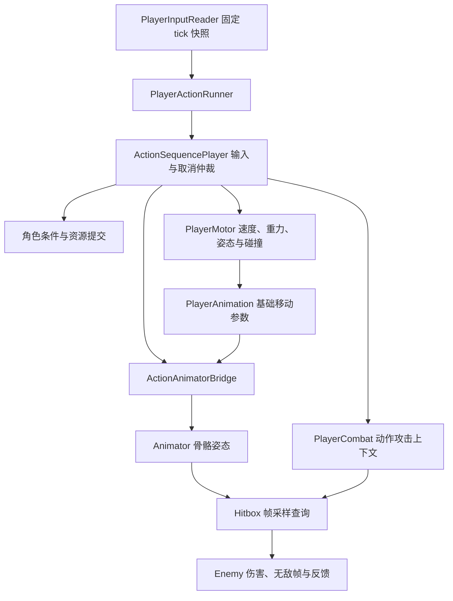

# 动作序列、Motor 与动画攻击接入说明

本文对应玩家当前攻击接入版本，面向策划配表、动画接线和运行时代码维护。

需求依据是本轮确认的动作序列方案及策划案 v1.03 第 5 节。当前 dev 已移除原策划案文件，可用 `git show 16adeac67d26e49a39be338bb878f658a4ae367a^:Docs/策划案v1.03.md` 查看历史需求。本说明记录工程实现，不替代战斗数值设计。

## 1. 当前接入范围与入口

`Assets/Prefabs/Player.prefab` 已配置 `PlayerActionRunner` 和 `ActionAnimatorBridge`。正常使用该预制体的场景会继承接线。运行入口仍是 BootScene / TestScene。

实际动作集为 `Assets/Settings/ActionSequences/Player/PlayerActions.asset`，包含：

| 资产 | 行为 |
| --- | --- |
| PlayerAttack.asset | 现有 Attack 素材、25 点基础伤害、逻辑帧命中窗口、常态收招接移动跳跃 |
| PlayerJump.asset | 跳跃输入与预输入，起手帧执行 Motor 跳跃命令；覆盖地面跳跃和符合条件的蹬墙跳 |
| PlayerSlide.asset | 滑铲起手请求；持续减速、按住/松开和能否站起由 Motor 处理 |

`Examples/ExampleActions.asset` 仍是独立演示动作集，展示 1.03 的更多取消关系，未挂到玩家。实际动作集与演示资产互不覆盖。

当前玩家攻击沿用已有单条素材，尚未实现高速攻击差分、速度伤害曲线、落地清空动量、parry、断肢、连斩和推斩。常态跳跃取消要求当前速度低于 `MovementParams.GroundSpeedThreshold × PlayerActionRunner.HighSpeedRatio`，默认比例在 Inspector 中为 0.8。

如果场景手工把 Animator 改成 `Animations/Test/test.controller` 或其他演示控制器，应使用支持本协议的 Controller，或在该动画实验角色上停用 Runner。装配工具只修改正式玩家预制体与指定控制器，不覆盖手工编辑的场景。

## 2. 组件职责与唯一写入方



- `ActionSequencePlayer` 是纯逻辑类，不读设备、Unity 时钟、Animator 或能量账户。
- `PlayerActionRunner` 是玩家接入层，负责输入采样、执行顺序、条件键、资源提交和退出清理。
- `PlayerMotor` 是唯一位置与速度执行器。动作系统不会直接写 Transform 位移，也不会用动画状态伪造地面、空中或划墙状态。
- 接入期间 `ActionAnimatorBridge` 统一驱动 Animator；`PlayerAnimation` 只在桥接调用下更新基础移动参数。
- `PlayerCombat` 保留伤害与打击感，接入期间停止旧攻击输入消费和秒计时路径。
- `Hitbox` 保留敌方和旧玩家触发器路径；新玩家攻击使用显式查询与命中去重。
- `VectorEnergy` 仍独立在移动结算后积能，读取 `PlayerFixedDeltaTime`，Runner 不重复积能。

## 3. 时间单位与执行顺序

项目固定逻辑为 60Hz。每个固定 tick 的玩家动作帧增量是：

```csharp
TimeManager.PlayerFixedDeltaTime * ActionSequencePlayer.FramesPerSecond
```

正常倍率通常推进 1 动作帧；0.25 倍率推进 0.25 帧。动作进度、冷却和 Motor 积分使用同一玩家时间层。预输入、序列间隔和长按阈值使用非缩放输入采样 tick。顿帧标识使用 `TimeManager.InHitStop`，不把所有慢动作都当作顿帧。

固定 tick 顺序：

1. `PlayerInputReader.CaptureTick` 生成本 tick 的输入快照，按下/松开事件保留发生时的修饰键与方向。同 tick 再次读取返回同一快照。
2. 识别输入、更新目标动作的预输入缓冲。
3. 检查起招条件、冷却、取消窗口、物理资格与能量。
4. 原子提交起招耗能。失败时保留原动作；成功后才结束原动作并启动新实例。
5. 以整数动作帧边界切分实际经过时间，对每个时间片应用当时所属段的 Motor 策略和动画区间。
6. 到达边界时先仲裁取消，再进入段、派发帧事件、采样当前姿态和命中盒。已取消动作不会在同帧再次打开判定。
7. 动作结束后，本 tick 剩余时间继续执行默认移动与基础动画。
8. `VectorEnergy` 在其固定回调中根据结算后的速度积能。

接入后 Motor 的自身 `FixedUpdate` 跳过模拟，Animator 的自动求值被关闭。一个 tick 跨越多个动作段时，所有时间片之和仍等于本 tick 的玩家缩放时长，避免重复积分或把最后一段策略套到整个 tick。

整数帧边界附近若剩余时间仅为浮点尾差（不超过 0.000001 动作帧），执行器把它并入当前运动步，保留完整经过时间。这样避免近零的额外 CharacterController.Move 丢失接地、被下一步误判为再次落地，并反复刷新免摩擦窗口。普攻仍允许移动与冲刺；平地持续冲刺受正常摩擦与地速阈值约束，真实落地的免摩擦窗口和 bhop 加速仍保留。

## 4. 动作时间轴与帧事件

每个 `ActionDefinition` 包含多个 `ActionSegment`。每段至少 1 帧，可以连续配置多个发生段，也可以在一次动作中再次进入发生阶段。`Phase` 是策划语义，取消权限由独立窗口决定。

事件帧为段内相对帧，合法区间是 `[0, DurationFrames)`。段末事件应放在下一段第 0 帧。多个同帧事件按配置顺序派发。

当前攻击迁移表如下；这些是从现有素材导入事件转换出的初始值，可在配表工具修改：

| 子段 | 全动作区间 | 时长 | 动画区间 | 事件 |
| --- | --- | ---: | --- | --- |
| startup_a 起势 | [0, 33) | 33 | 0～0.333333 | 无 |
| startup_b 引刀 | [33, 39) | 6 | 0.333333～0.393939 | 第 0 帧 `vfx.attack`，Value=1 |
| active 挥砍命中 | [39, 69) | 30 | 0.393939～0.696970 | 第 0 帧 `combat.hitbox.open`，HitGroup=1 |
| recovery 收招 | [69, 99) | 30 | 0.696970～1 | 第 0 帧 `combat.hitbox.close` |

总长 99 帧，输入预输入 8 个采样 tick，冷却 21 个玩家动作帧，从起招时开始计时。不同动作可以独立配置这些数值。

接入后应在 PlayerAttack 动作表修改伤害、冷却和段时长。PlayerCombat 的旧 AttackDuration、AttackCooldown、AttackDamage Inspector 字段用于未接入角色和首次迁移取值；已有场景对这些旧字段的覆盖不会修改序列动作配置。

迁移通过 `AnimationUtility.GetAnimationEvents` 读取**导入后的 AnimationClip**，使用事件时间与片段长度映射帧数。FBX `.meta` 的事件时间字段不能直接当作秒数乘 60。旧 `FinishAttack` 事件不决定新动作的结束时间，结束由整个时间轴决定。

### 已接入的事件键

| EventKey | 参数 | 行为 |
| --- | --- | --- |
| combat.hitbox.open | HitGroup | 开启本动作实例的命中窗口，选择命中段编号 |
| combat.hitbox.close | 无 | 关闭命中窗口，保留本实例已有命中记录 |
| vfx.attack | Value=1/2/3 | 播放现有对应刀光粒子 |
| motor.command | MotorCommand、Value | 执行一次运动命令 |

其他事件可通过 `PlayerActionRunner.FrameEvent` 接入。当前内置事件不会把 `Value` 当作伤害，伤害来自 `ActionDefinition.Combat.Damage`。

## 5. 动画状态机接线

正式控制器是 `Assets/Animations/player.controller`，原来的 Idle、Move、Jump、Trackle、Attack 根状态保持可用。新增 `Actions` 子状态机，当前动作状态完整路径是：

```text
Base Layer.Actions.PlayerAttack
```

该状态的 Motion 使用现有 Attack Clip，并启用按状态独立生成的 Motion Time 参数，例如 `ActionTime::Base Layer.Actions.PlayerAttack`。控制器参数：

| 参数 | 类型 | 写入方与用途 |
| --- | --- | --- |
| MotionState | Int | PlayerAnimation 根据 Motor 提供基础移动状态 |
| RunBlend | Float | 根据水平速度调整 Walk/Run 混合 |
| IsAttacking | Bool | 旧攻击兼容路径；接入模式下不再据此进入攻击 |
| ActionPlaying | Bool | 桥接控制，限制基础 Any State 转移抢占动作 |
| ActionTime | Float | 当前动作动画归一化时间的诊断值 |
| ActionTime::完整状态路径 | Float | 状态实际采样时间，按状态独立生成并由桥接写入 |

每个动画绑定包括 `AnimatorState` 完整路径、`Layer`、`Clip`、`NormalizedStart`、`NormalizedEnd` 和 `BlendFrames`。

播放进度计算：

```text
ActionTime = NormalizedStart
           + (NormalizedEnd - NormalizedStart)
           × Clamp01(SegmentFrameProgress / DurationFrames)
```

- 同一实例相邻段绑定同一状态与层时，继续当前状态，仅更新播放区间。
- 新动作实例再次使用同一状态时重新起播。当前同状态重启使用直接 Play，确保不会继续旧动作的时间；不同状态支持 CrossFade。
- 状态切换混合时长是 `BlendFrames / 60`，受同一玩家缩放时间推进。
- 不同动作状态使用独立 Motion Time 参数；取消时保留旧状态的最后姿态，新状态从自己的区间起点播放，避免共享参数把旧姿态一起拉回起点。
- 动作结束或取消由序列通知，桥接立即转入目标动作或根据 Motor 当前状态回到基础动画，不等待 Animator Exit Time。
- Animator 手动 `Update` 接收已缩放时间，因此接入期间 `Animator.speed=1`，避免慢动作被乘两次。
- Animator 自动求值、内置动画事件被关闭，culling 设置为 AlwaysAnimate，保证命中盒使用当前骨骼姿态；解除接入时恢复之前的 enabled、speed、fireEvents 与 culling。
- Root Motion 保持关闭，所有角色位移由 Motor 执行。

第一版正式攻击使用第 0 层全身状态。`Layer` 作为扩展接口保留；多层 Avatar Mask、分层占用与独立时间参数尚未完成，不应直接配置多个同时播放的动作层。

动作动画素材的采样 FPS 不决定逻辑帧率。30 FPS 素材也可以映射到 60Hz 动作时间轴。当前模型表现按逻辑步求值，未加入渲染帧之间的骨骼插值。

## 6. 命中窗口与伤害

`Combat.Enabled` 表示动作是否创建攻击上下文；`Damage` 是该动作基础伤害；`HitMask` 决定命中查询层。没有启用 Combat 的动作不会通过战斗帧事件打开伤害窗口。

接入期间玩家命中盒 Collider 保持关闭，避免物理触发回调再结算一次。查询使用现有 BoxCollider 的中心、大小、旋转与世界缩放，采样前先更新动画姿态并同步 Transform。

每个成功命中的去重范围是：

```text
动作实例 InstanceId × HitGroup × Enemy
```

一个敌人有多个 Collider，同一命中段也只成功受伤一次。关闭后重开相同 HitGroup 不会再次伤害已经命中的敌人。多段攻击要配置不同 HitGroup；新动作实例自动获得新记录。敌人无敌帧仍由 Enemy 决定，未实际造成伤害的查询不会登记成功命中。

查询缓冲满时扩容后重查，避免密集敌人被固定容量漏掉。当前使用逐姿态 OverlapBox，尚未加入两帧之间的武器轨迹扫掠。

即使一次 Tick 同时跨过窗口开启和关闭，逐帧边界采样仍覆盖中间命中帧。命中后的伤害数字、震屏、短冲击与慢动作继续走已有 Enemy / PlayerCombat / TimeManager。

## 7. Motor 接入和运动命令

`TryAcquireSimulation / ReleaseSimulation` 管理 Motor 的模拟归属。接入时 Runner 取得归属，自身 FixedUpdate 停止重复模拟；解除接入后恢复旧输入驱动。

| 段控制字段 | 含义 |
| --- | --- |
| AllowMove | 是否接受主动移动加速；已有速度继续受惯性、摩擦和碰撞规则影响 |
| AllowTurn | 是否允许普通角色转向；划墙约束仍优先，相机独立转动 |
| AllowSprint | 是否接受冲刺输入 |
| AllowJump / AllowSlide | 原始输入的兼容门控；已由动作集接管的跳跃/滑铲起手通过动作请求与取消窗口仲裁 |
| GravityMultiplier | 重力加速度倍率；为 0 时保留已有竖直速度 |

旧 `MovementCommand / CommandValue` 字符串槽保留序列化兼容，但玩家 Host 会拒绝未注册的旧字符串命令。新配置使用 `motor.command` 帧事件和有明确类型的 `MotorCommand`。

| MotorCommand | Value | 行为 |
| --- | --- | --- |
| Jump | 忽略 | 根据物理状态执行地面跳或蹬墙跳；复用现有跳跃计数和墙面保护 |
| EnterSlide / ExitSlide | 忽略 | 检查速度、地面状态及站起空间后改变姿态 |
| SetHorizontalSpeed | 目标速度 | 保留水平运动方向并按 MaxSpeed 限制 |
| LaunchVertical | 竖直速度 | 发出向上的运动命令，更新实际空中状态 |
| ReverseHorizontal | 忽略 | 翻转水平速度与角色朝向，退出划墙 |
| AddForwardImpulse | 速度增量 | 沿角色朝向叠加水平速度并限制 MaxSpeed |
| ClearHorizontal | 忽略 | 清空水平动量 |

起手第 0 帧命令在扣费前检查 `CanExecute`。后续帧命令仍需检查当时的物理状态；无法执行时返回失败并记录提示，不强制穿越碰撞约束。

Jump 命令在事件帧提交请求，在随后属于该动作的运动时间片内执行。这样保留旧 Motor 的「先地面/墙面加速，再起跳」顺序和 bhop 加速行为；若窗口恰好在 tick 末开放，实际起跳积分发生在下一个运动步。中断会清理尚未执行的跳跃命令。

Jump 配置拥有跳跃预输入，Runner 不再把 JumpPressed 交给 Motor 的旧跳跃缓冲。SlidePressed 同样由实际动作表接管，但 SlideHeld 继续传给 Motor。滑铲动作起手结束不强制站起，头顶不足时维持合法的低姿态。

## 8. 取消窗口与预输入

取消窗口独立于阶段，可以重叠。每个窗口指定起终锚点、目标动作、RequireAll / RequireAny 条件及优先级。权限取所有有效窗口的并集，区间为左闭右开。

当前实际攻击的收招窗口为 `[recovery 开始, 动作结束)`，目标是 PlayerJump，要求 `non_stationary_jump` 和 `speed_low`。请求方向取输入发生时的方向，之后改变移动输入不会把原地跳请求变成移动跳请求。

- 发生、持续段的跳跃按键先进入 Jump 的预输入缓冲，窗口开放且物理条件满足时才切换。
- 原地跳不能取消当前攻击；请求仍可能在攻击自然结束后、尚未过期且物理条件满足时执行。
- 普通攻击不是该窗口目标，所以再次按攻击键不会取消当前攻击。靠近自然结束时的有效预输入可以接续下一次攻击。
- 多个取消窗口可以针对不同动作配置不同条件与时段；有向图展示配置关系，实际准入还要检查角色上下文。

预输入长度配置在目标动作 Input 中。长度 N 的有效区间为 `[CreatedTick, CreatedTick+N)`；0 只尝试当前采样 tick。LatestInGroup / EarliestInGroup / Queue 控制同组替换。源动作取消后是否保留其他请求由 KeepOnSourceCancel 决定。

普通攻击输入禁止 Skill 修饰键；右键组合攻击尚未加入实际动作集，因此 Skill+Attack 不会退化为普通攻击。同一输入事件只归属一个识别结果，资源不足也不会回退成其他招式。

## 9. 条件、资源与扩展接口

内置条件键：`grounded`、`airborne`、`wall_sliding`、`sliding`、`can_jump`、`can_slide`、`speed_low`、`speed_high`、`non_stationary_jump`、`forward_jump`、`flash_available`。

`flash_available` 读取注入的 parry / limb_break 标志；这些玩法的检测尚未实现。外部系统通过 `SetCondition(key, bool)` 注入扩展条件。未知且未注入的键返回 false，不会默认放行。

资源默认读取 Inspector 的能量组件或同根 VectorEnergy，契约是 `IEnergyAccount`。也可以调用 `SetEnergyAccount` 注入其他账户。`CanStart` 只检查；`TryCommit` 成功后扣一次，失败完全不扣费也不结束原动作。MobilityAbilities 的旧 TryTrigger 已自行扣费，后续接入时必须选择一个统一扣费入口。

```csharp
runner.SetCondition("parry", true);
runner.SetEnergyAccount(customEnergyAccount);
runner.FrameEvent += HandleCustomEvent;
runner.Player.Queue(targetAction, inputTick, direction);
runner.Interrupt();
runner.ResetActions();
```

不要从另一个 FixedUpdate 同时调用 Runner.SimulateTick 或 Motor.Simulate。手动 SimulateTick 是测试、回放与外部统一循环接口，使用时需避免 Runner 的自动循环也在运行。

## 10. 生命周期清理

| 触发 | 行为 |
| --- | --- |
| 动作完成 | 关闭命中上下文，释放段控制，恢复基础动画；允许粒子自然收尾 |
| 动作取消 / Interrupt | 关闭窗口，释放控制，停止旧动作刀光；按规则清理相关请求 |
| 输入 Clear、失焦、Gameplay Map 切换 | 清理请求和输入识别历史，保持当前动作进度与冷却 |
| Motor.Teleport | ResetActions，清理动作、请求、冷却、扩展条件与输入 |
| PlayerData 死亡 | SetAlive(false)，中断动作并禁止新起招 |
| PlayerData.Reset | 恢复存活并重置动作 |
| Runner 停用或销毁 | 清理动作并归还输入、Motor、Animator 的控制权 |

暂停不重置动作时间轴。TimeManager 总时间层停止时固定逻辑停止，恢复后继续。世界时停与玩家顿帧是不同效果，攻击结束不会自动解除世界时停。

## 11. 配表与模型预览操作

1. 打开「超高速行者 → 动作序列配表」，选择正式 PlayerActions，或双击该资产。
2. 在「动作配表」选择动作，编辑时间轴、Input、Combat、控制策略与帧事件。
3. 动画绑定通过状态下拉选择完整路径，拖动播放区间，并设置段时长和混合帧数。多个发生段可以共享同一动画。
4. 选择正式 player.controller 和玩家预制体，点「载入模型」。拖动视图旋转观察；拖动预览帧检查姿态。
5. 在「独立执行预览」模拟输入、能量、条件、慢动作和顿帧。模型克隆同步播放当前沙盒动作，沙盒不会对场景角色造成伤害或执行真实位移。
6. 在「取消链有向图」点边标签，再点「预览取消 → 目标动作」。工具会填充模拟条件，在窗口起点发出目标请求；执行器仍检查窗口、冷却和准入。条件通过后会看到动作切换及日志。
7. 在「动作集与检查」处理 ID、锚点、帧事件、Animator 状态、Motion Time 和 Clip 不一致等错误，保存资产。

模型预览只在显式载入时实例化并缓存，关闭窗口会释放克隆和 PreviewRenderUtility。骨骼求值使用克隆 Animator，不写当前场景 Animator；预览中的位移、地面状态和技能效果不等于真实运动模拟。

新增动作状态可在 Animator 的 Actions 子状态机中创建并配置对应 Motion Time 参数，也可在配表工具选择控制器后点「装配动画状态」。正式玩家动作表还可通过「超高速行者 → 动作序列 → 接入玩家攻击」增量装配：首次生成缺失资产，后续保留已有配表；缺失且位于 `Base Layer.Actions.*` 的状态可按绑定 Clip 创建。修改已有状态的 Motion 时应与动作绑定同步。

原 PlayerAnimationSetup 在发现 Actions 子状态机后改为增量装配，避免整体重建清掉动作状态。接入装配会先退出 Play 模式，再修改预制体并保存。

## 12. 验证与排查

```powershell
& ./Tools/ActionSequences/validate.ps1 -Stage Compile
& ./Tools/ActionSequences/validate.ps1 -Stage Install -UseRepositoryPackages
& ./Tools/ActionSequences/validate.ps1 -Stage EditMode -UseRepositoryPackages
& ./Tools/ActionSequences/validate.ps1 -Stage PlayMode -UseRepositoryPackages
& ./Tools/ActionSequences/validate.ps1 -Stage All -UseRepositoryPackages
```

Compile 使用冻结版本参考程序集检查整个运行时代码与编辑器代码。其他阶段在 `Temp/PlayerActionValidation` 的工程副本运行 Unity，不关闭当前编辑器，不改变当前工程 Packages 或场景。`UseRepositoryPackages` 仅让副本使用 dev 已提交的依赖，避免本地额外工具包参与验证。

日志与 XML 位于上述副本目录。测试覆盖输入归属与缓冲、取消边界、资源提交、手动 Humanoid 姿态采样、相邻发生段、同状态重启、短窗口、命中段去重、Motor 模拟归属、慢动作与暂停、死亡和重生清理，以及配置落盘和工具界面。

2026-10-04 修复冲刺普攻异常加速后，执行 `-Stage All -UseRepositoryPackages`：运行时与编辑器编译通过，EditMode **53/53**、PlayMode **3/3** 通过。EditMode 包含原模块 30 项、时间尾差回归 2 项与玩家接入 21 项；新增平地冲刺对比覆盖有无攻击、1 / 0.35 / 0.05 三种倍率，逐 tick 检查接地、免摩擦资格、地速阈值和实际积分时长。PlayMode 使用正式玩家预制体验证真实鼠标输入、固定步推进、组合键不回退、传送与解除接入。当前 dev 的 `Assets/Tests` 没有原移动系统的 27 项测试文件，因此本次结果不表示那 27 项已运行。测试使用冻结 Unity 2022.3.33f1 及已提交的依赖；本地额外包与场景手工覆盖需在当前编辑器中另外联调。

常见检查：

- 无法接入：检查 Console 中 Runner 给出的缺失引用、状态路径或参数类型；尤其注意场景对 Controller 的覆盖。
- 动画立刻被移动抢走：检查基础 Any State 转移是否受 ActionPlaying=false 限制。
- 动画与逻辑不同步：检查动作状态启用对应的独立 Motion Time 参数，且没有另一个脚本手动更新 Animator。
- 攻击没有伤害：检查 Combat.Enabled、HitMask、命中盒引用，以及开关事件的位置和 HitGroup。
- 同一敌人需要第二次受伤：使用新 HitGroup，并确认 Enemy 无敌帧已结束。
- 跳跃没有取消：检查输入发生时方向、当前速度、窗口区间、物理 CanJump 及目标预输入是否已经过期。
- 自定义命令无效果：使用 motor.command 与明确的 MotorCommand；扩展事件通过 FrameEvent 注册。

当前场景中没有能量账户时，零耗能攻击与移动起手仍可运行；耗能动作会明确被拒绝，需要完成能量组件接线后再启用。
